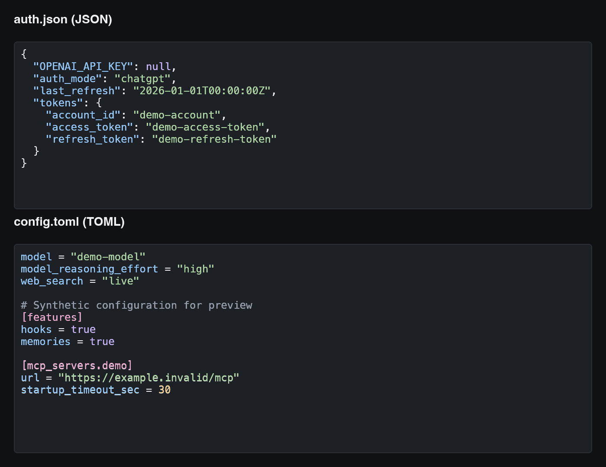
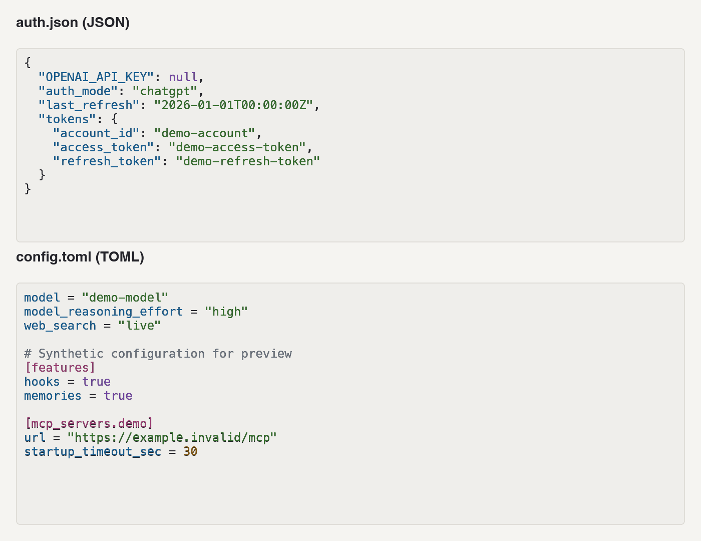

# JSON / TOML 代码高亮

2026-09-29，macOS arm64、Slint 1.18.1。

订阅 `auth.json`、订阅 `config.toml`、通用配置编辑区与供应商配置预览共享 `CodeEditor`。字段、字符串、数字、布尔值/null、TOML 注释和表头分别着色，支持浅色与深色主题。输入不完整或无效时仍可着色，保存校验沿用现有逻辑。

高亮只生成当前编辑器的显示片段，保留原文、UTF-8、换行和空白。显示层使用不接收鼠标事件的 `Text`，与原生 `TextInput` 同步滚动；输入法组合输入期间隐藏显示层。认证内容不新增文件、日志或导出路径，取消与导航继续清空认证草稿。

| 检查 | 结果 |
| --- | --- |
| `make check` | Rust/Slint 格式、Clippy 通过；164 项测试通过，1 项已有本地 CLI 检查保持 ignored |
| 高亮回归 | 3 项合成测试覆盖 JSON 转义、Unicode、未完成输入，TOML 表头/数组/内联表、注释、多行字符串与 CRLF 定位 |
| 原生组件探测 | 高亮前后鼠标定位与跨行拖选结果相同；制表符、尾随空白、CRLF 与 1000 行布局通过；行首字符着色正确 |
| 隔离应用界面 | `managed_accounts_desktop` 使用临时数据目录、Codex 目录和合成账号；JSON/TOML 修改后同步着色，主题切换正常，TOML 控件同步与无效输入校验保持可用 |
| 取消与清理 | 关闭认证编辑区后凭据不再出现在界面；合成原生登录和配置原文未改写，无恢复 journal；测试进程和临时目录已清理 |
| 调试包 | `sh scripts/bundle-macos.sh` 成功更新 `target/debug/SwitchX.app` |

下图是临时 Slint 窗口引用实际 `CodeEditor`、主题与高亮函数生成的原生组件截图，全部使用合成示例，仅展示语法着色。没有读取用户真实登录文件或进行真实上游请求。

