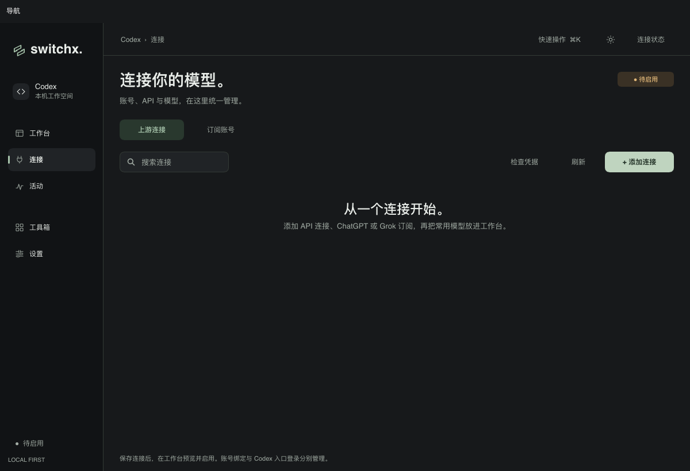
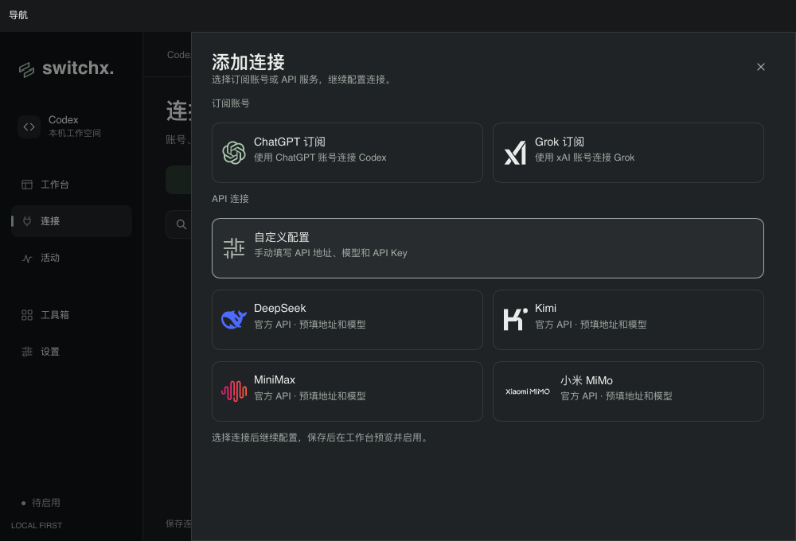
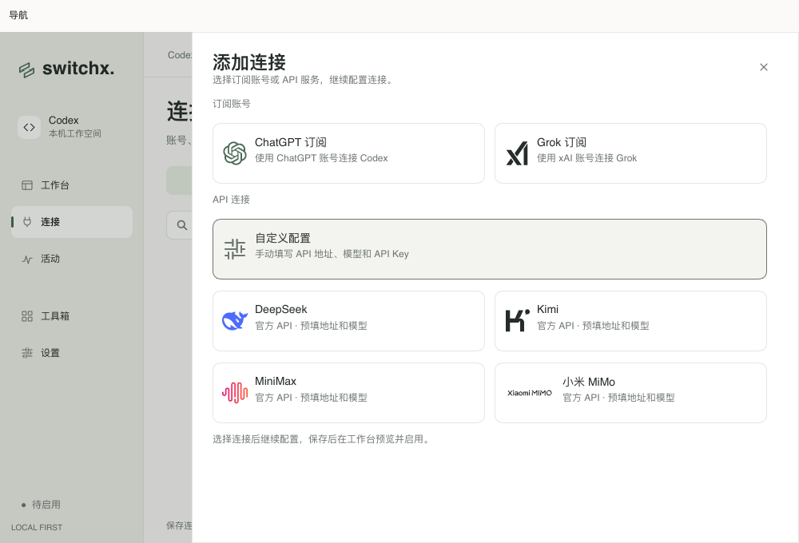
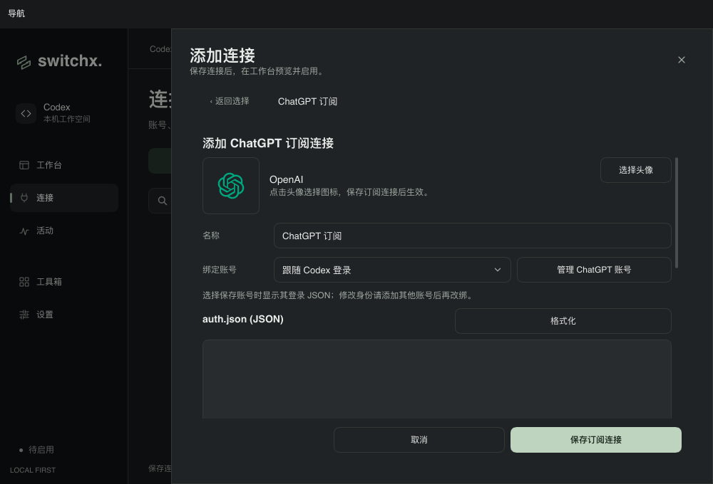
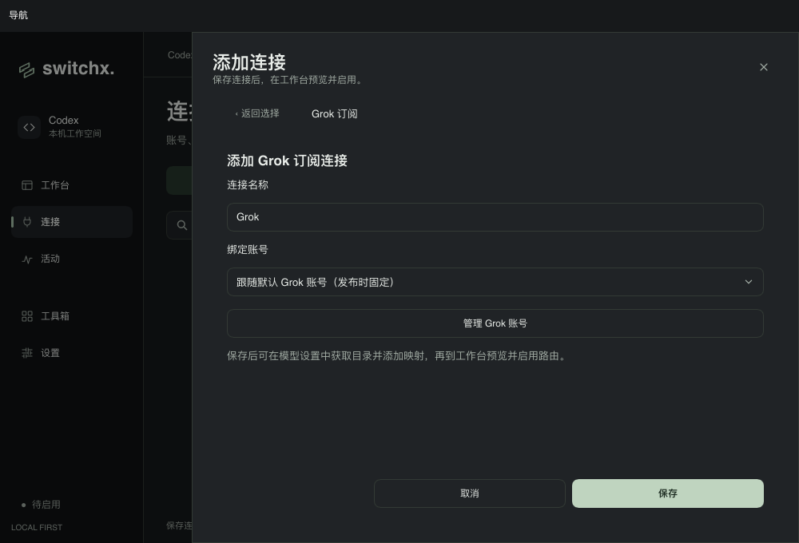
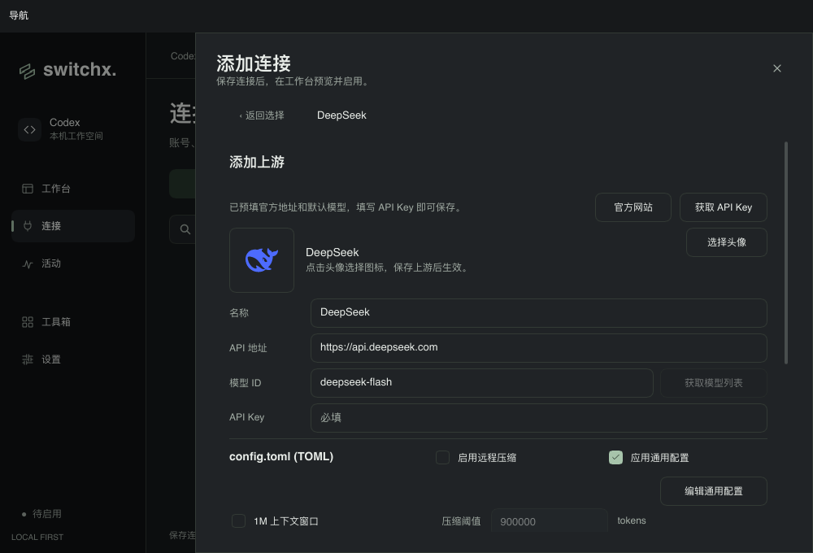

# 统一添加连接弹窗 · 2026-10-08

“连接 → 上游连接”与快速操作都使用“添加连接”入口。参考 `others/cc-switch` 的两步选择流程，先在弹窗内选择订阅账号、自定义 API 或官方预设，再在同一弹窗内填写对应表单。

- 订阅账号：ChatGPT、Grok。
- API 连接：自定义配置、DeepSeek、Kimi、MiniMax、小米 MiMo；官方预设继续预填名称、地址、模型和头像。
- 新建表单提供“返回选择”。返回、关闭、Esc 或导航离开会清空未保存的 API Key 和认证编辑内容；配置管理中与后台任务期间禁止添加，ChatGPT 登录期间禁止选择 ChatGPT 订阅。
- API、ChatGPT、Grok 使用一个弹窗外层。切换表单时重新设置键盘焦点，保留 Esc 关闭、头像选择和通用配置编辑流程。

## 验证

```sh
make check-app
SWITCHX_CONNECTION_SNAPSHOTS=/tmp/switchx-connection-picker-2026-10-08 \
  cargo test --locked --bin switchx unified_connection_picker_routes_choices_and_clears_credentials -- --nocapture
make check
sh scripts/bundle-macos.sh
```

以上命令通过。完整检查包括 Rust/Slint 格式、Clippy 和 189 项通过的测试；另有 1 项需要本地 Codex CLI 的目录解析测试按原配置跳过。

焦点与点击测试使用真实 Slint 组件、生产表单初始化函数和合成资料，覆盖页头入口、两个订阅、自定义 API、四个预设、返回、Esc、关闭按钮、遮罩点击、禁用状态与导航离开。软件渲染截图检查了深浅主题和 1200×820、1000×680 两种尺寸。

本机另以独立 bundle、绝对 `SWITCHX_DATA_DIR` 和隔离 `CODEX_HOME` 启动空白预览，实际点击验证了 ChatGPT → 返回 → Grok → 返回 → DeepSeek 的表单切换、API 地址/模型预填、Esc 关闭，以及 ⌘K → 添加连接打开相同选择页。本轮验证未执行真实账号登录、保存凭据、路由发布或上游请求。

## 截图












