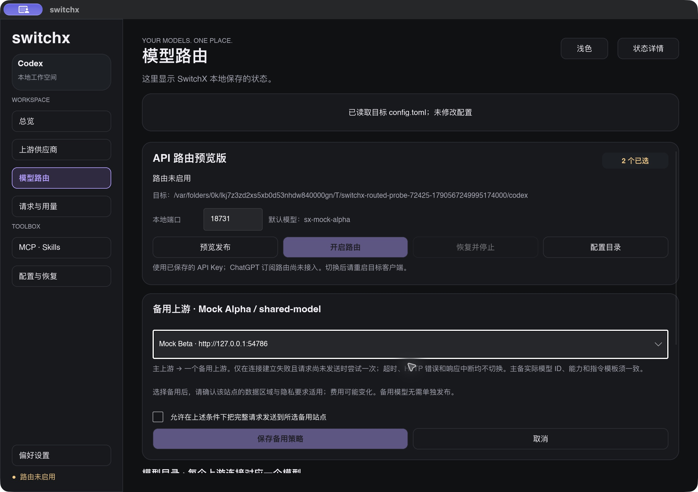
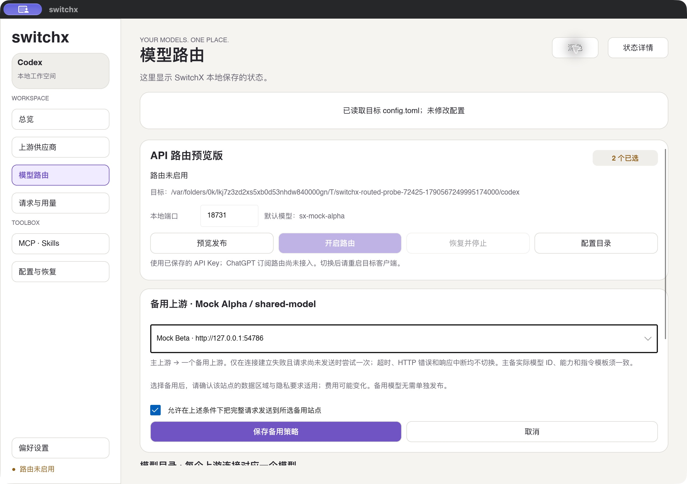

# M3 显式备用上游验收

## 范围

2026-09-28，macOS arm64、Slint 1.18.1、本机 Codex CLI `0.158.0-alpha.2.1`。本批提供“主上游 → 一个显式备用”的策略，使用本地假上游、独立临时 `CODEX_HOME`、SQLite 和合成钥匙串条目。没有读取真实上游 Key、调用真实供应商或修改用户 Codex 配置。

## 结果

| 检查 | 结果 |
| --- | --- |
| 数据迁移 | v1–v4 升级到 v5；已有上游、模型与请求记录保留，备用默认关闭；重开后保留策略，删除备用连接清除引用 |
| 选择约束 | 自引用、未导入资料、不同实际模型 ID、上下文/工具/指令或未知能力字段不一致均被拒绝；允许仅展示资料不同 |
| 单次切换 | 本地 HTTP 测试验证主端口拒绝连接后仅请求一次备用；主备均不可连接返回固定错误，并记录两者 |
| 不安全重放禁止 | 400/401/402/403/429/503、缺少完成事件的 SSE、已收到请求但未返回响应头就断开，以及请求超时，均不访问备用；429 保留 `Retry-After` |
| 取消与停止 | 已配置备用时，客户端释放流和 5 秒排空后停止路由仍取消上游，不访问备用 |
| 认证与隐私 | 备用仅收到自己的 Key；客户端 Bearer、账号头、Cookie、本地 token 不转发；SQLite 不含合成 Key、提示词或原始错误正文 |
| 发布保护 | 未单独发布的备用仍进入运行快照；修改备用地址后旧预览无法应用；运行中不能修改策略 |
| 隔离 CLI | `--fallback` 先通过主备目录检查，再关闭主假上游；相同公开 ID 在备用完成读文件、工具结果和第二轮回答，两条记录均为完成并包含主备去向；随后恢复原配置、清除 journal 和测试凭据 |
| 原生编辑 | 实际操作下拉选择、未勾许可时保存禁用、勾选后保存成功；备用取消独立发布后仍在主模型预览中列出；端口 0 被 UI 校验拒绝 |
| 原生外观 | 深浅主题检查并保存截图，包含目标站点、策略限制、许可确认和保存按钮 |

自动化共 50 项通过，Clippy、Rust/Slint 格式检查和 macOS 调试 bundle 构建通过。首轮并发测试出现临时数据库文件冲突；测试数据库改用随机文件名后通过。协议判定以锁定的 reqwest 0.13.5 及 hyper-util 连接错误实现为依据：只允许非超时的 connector 错误，不把等待响应头失败当作请求尚未发出的证据；同时关闭 reqwest 默认协议重试。

## 系统凭据确认的限制

GUI 点击“开启路由”后出现 macOS 钥匙串访问确认。Computer Use 工具明确拒绝操作 `com.apple.SecurityAgent`，本轮未自动确认，也未绕过系统权限。检查临时配置仍为原内容且没有 journal 后，结束了该隔离 GUI 进程；探针报告非正常退出并执行自身清理，临时目录已不存在。**本轮 GUI 的启用和备用请求没有完成验收**；上述 CLI 结果使用生产 `RouteSession`，不替代这个 GUI 步骤。M2/M3 较早的原生路由验收记录仍按原范围保留。

备用 CLI 流程在本轮较早构建中通过。最后补充候选耗尽错误码和迁移断言后，50 项测试与构建检查再次通过；最终二进制的普通 CLI 回归则出现 `auth.command` helper 5000 ms 超时，尚未通过本地鉴权，不能记作最新二进制的完整 CLI 验收。该探针也已恢复并清理。完成系统凭据确认后，需重跑上面的普通/备用两种 CLI 探针。

## 截图





## 复跑

```sh
cargo test --locked --all-targets
cargo clippy --locked --all-targets -- -D warnings
make format-check
sh scripts/bundle-macos.sh
cargo run --locked --example routed_cli_probe
cargo run --locked --example routed_cli_probe -- --fallback
cargo run --locked --example routed_cli_probe -- --desktop-fallback
```

## 边界

- 每个请求最多一个主连接和一个备用连接；不跟随备用的策略，不提供多候选链、跨模型替换、熔断、冷却或后台探测。
- 主备共享 120 秒预算；任何超时都不会切换。每个新的客户端请求仍先尝试主连接；客户端自己的重试不受这项单请求策略控制。
- 主备启动时均须通过凭据与 `/models` 检查。资料相同不等于真实能力相同，费用、区域与隐私适用性仍由用户选定站点时确认。
- 请求记录持久化备用来源及最后尝试的去向，切换原因固定为发送前连接失败。计时覆盖主备总耗时，没有每次连接的独立计时、token 或费用。
- 未验证真实 DeepSeek ↔ 官方、ChatGPT 订阅认证生命周期、跨供应商同会话工具历史、Desktop/IDE 或其他操作系统。产品仍标为 API 路由预览版。
