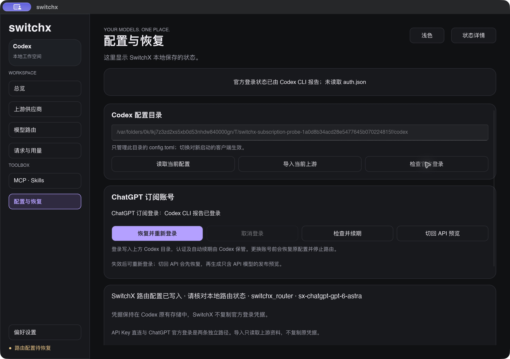
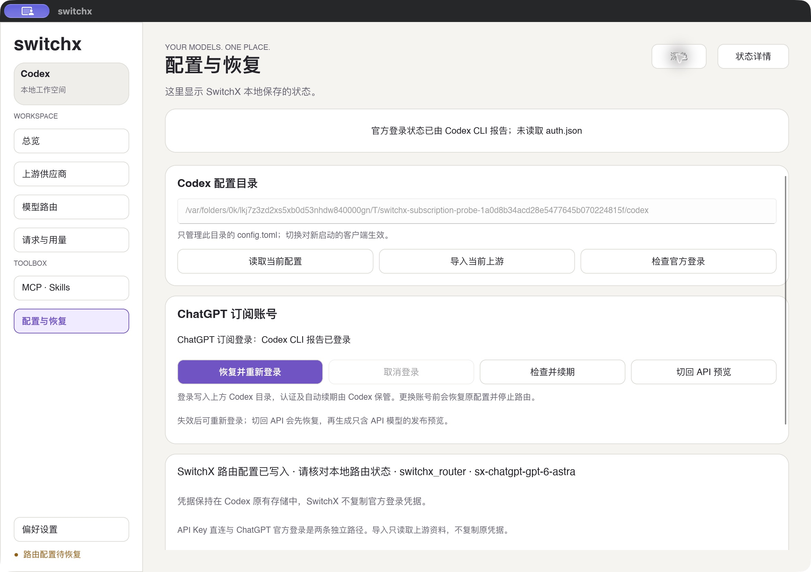
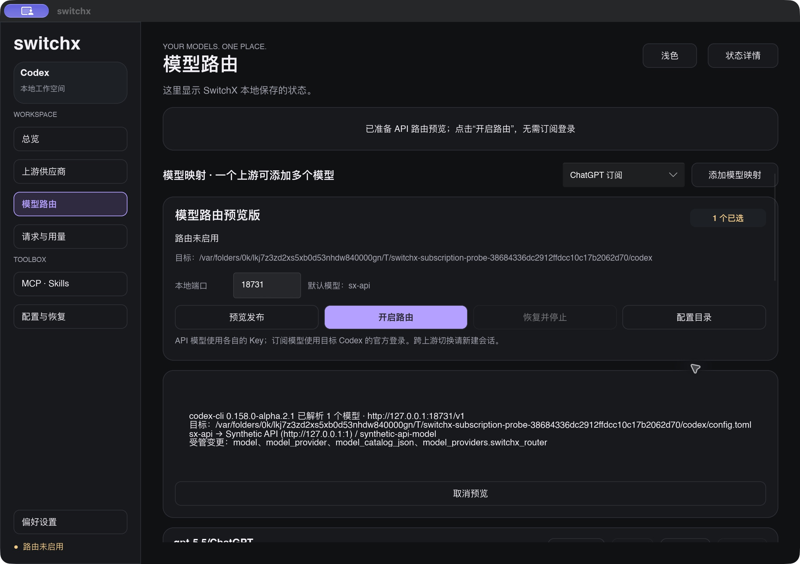

# M3 订阅账号路由实现与隔离验收

## 范围

2026-09-28，macOS arm64、Slint 1.18.1、本机 Codex CLI `0.158.0-alpha.2.1`。最终探针使用权限受限的临时数据目录、独立 `CODEX_HOME`、明确标为合成的 ChatGPT 形状凭据、本地工作区发现服务和本地模型假上游。没有使用真实账号凭据，没有向真实官方或第三方模型发送请求。

## 实现

参考本地 CC Switch `da193d4` 的 [官方 provider 判断](https://github.com/farion1231/cc-switch/blob/da193d4f7a6ce3710623c312245c752376c0d036/src-tauri/src/proxy/providers/codex.rs) 和 [认证透传](https://github.com/farion1231/cc-switch/blob/da193d4f7a6ce3710623c312245c752376c0d036/src-tauri/src/proxy/forwarder.rs)，SwitchX 使用显式订阅连接身份决定官方认证路径。工作区元数据由目标 Codex app-server 返回；新版本的工作区、HTTPS ChatGPT origin 和区域约束在预览及启用时一致核对。缺少该元数据的旧版本使用固定官方端点并在首个请求绑定工作区，不能按模型名推断账号或目的地。

登录、取消、账号检查与续期请求通过原生 app-server；OAuth 令牌由 Codex 自己保存和更新，SwitchX 不读取或复制。含订阅模型时，Codex provider 使用 `requires_openai_auth = true`，本地校验用独立 `x-switchx-local-token`。本地令牌在用户配置及 journal 中的文件权限为 `0600`，不转发上游。API 上游仍使用自己保存在系统凭据存储的 Key。

官方只收到该工作区的认证和允许的 Codex 协议头。API 只收到映射上游的 Key，官方认证、工作区、区域路由与本地令牌全部丢弃。官方 401/403 保留原状态及响应正文，允许 Codex 处理认证恢复；界面只显示安全的错误分类。请求不重放，订阅连接不参与显式备用。

官方 compact 和加密推理/压缩上下文可转发；API compact 返回 501，加密上下文返回 422。两条路径都拒绝服务器状态引用，跨上游要求新建会话。官方模型保留 CLI 内置完整指令/工具资料并使用普通 Responses SSE；内置列表不代表真实账号模型权益。

“登录 ChatGPT”会先恢复受管配置并停止路由；恢复冲突时不开始登录。“切回 API 预览”恢复后取消订阅映射的发布选择，准备仅含已选 API 模型的预览，需点击“开启路由”才发布。恢复不回写 `auth.json`，保留 Codex 自己产生的新登录状态。当前衔接一套 `CODEX_HOME` 的原生账号，没有多账号 OAuth 凭据管理器。

## 检查结果

| 检查 | 证据与结果 |
| --- | --- |
| 自动检查 | 最终 `make check` 通过 61 个库测试、2 个主程序测试、7 个路由集成测试，共 70 项；另有 1 个需本机 CLI 的目录测试忽略。Rust/Slint 格式及 Clippy 通过 |
| 全目标测试 | `cargo test --locked --all-targets` 额外运行 6 个示例测试，共 76 项通过、1 项忽略；没有执行真实模型探针的入口 |
| 原生账号接口 | mock app-server 覆盖账号类型、请求续期、登录快速完成通知、取消、超时和脱敏错误；原生 CLI 在隔离合成账号中完成账号读取与登录开始/取消，原合成登录文件字节保留 |
| 目录冲突 | 合成回归用例覆盖已有映射重命名和模型 ID 归一化冲突，整批拒绝写入，原映射、启用状态和元数据保留 |
| API 切回选择 | 用现有存储事务一次性取消订阅模型选择；合成用例核对多个订阅模型全部取消、API 映射及其启用/元数据保留、重复操作幂等 |
| 无效切回输入 | 原生界面同时选择 API 与订阅模型后，填写无效端口再切回，先提示端口错误；界面和 SQLite 均保留两项选择。修正端口后只剩 `sx-api`，预览按钮启用，配置仍保持恢复状态 |
| 工作区与区域 | 无效或伪造 origin、区域约束和工作区拒绝；原生 CLI 读取本地发现服务的工作区资料，生产预览包含官方目的地；路由阻止更换工作区或区域 |
| 官方与 API 认证 | 本地 mock 覆盖缺少本地令牌、重复/无效 Bearer、API Key 冒充订阅、管理占位令牌、Cookie 和任意头隔离；同名模型按公开 ID 到达各自上游 |
| 失效与权限 | mock 官方 401/403 原状态与正文返回，记录固定安全错误码；同工作区换用新的合成 Bearer 后下一次请求成功，路由不重放原请求 |
| 协议 | SSE 字节保持、zstd 请求解压后仅替换模型、加密推理与工具结果转发；官方 compact 完整结果记为完成，API compact/加密上下文拒绝 |
| 原生 CLI 工具轮次 | `chatgpt_route_probe` 在两种认证路径各完成一次“读取合成文件 → 工具结果 → 第二轮回答”，共四条请求记录均为完成；未串到另一上游 |
| 配置与登录保留 | 生产配置事务的本地独立头与原生认证可同时使用；恢复后的配置逐字节一致，journal 清除，合成 `auth.json` 保留；临时目录与监听清理 |
| 原生界面 | 隔离桌面夹具的账号检查报告 ChatGPT 已登录，深浅主题布局可见；切回 API 后只选 1 个 API 模型、默认 `sx-api`，发布预览可用且“开启路由”启用。修改端口后按钮禁用，重新预览后启用；尝试开启无 Key 的合成 API 返回缺少凭据，不写配置 |
| 桌面恢复与退出 | 夹具退出状态为 0；journal 清除，原配置及合成登录文件字节一致，临时资料与监听清理 |
| 登录启动失败 | 临时 CLI 包装器模拟 app-server 退出；原生界面报告登录服务失败并禁用旧预览的“开启路由”，不打开浏览器；退出后原配置与合成登录文件保留，临时包装器已删除 |

原生工作区探针初次失败是合成元数据不符合 Codex 的区域枚举要求。夹具改为有效的 `NO_CONSTRAINT` 和 HTTPS 官方 origin 后，原生账号读取及生产预览通过；没有通过修改生产校验放宽目的地。

切回 API 后，Slint 的默认模型延迟变更通知曾使有效预览的按钮误禁用。预览现在记录对应的默认模型，只在选择与预览不一致时失效；原生界面已复验切回、修改端口和重新预览。

重新登录在恢复后立即撤销旧预览的可应用状态，因此原生登录服务启动失败也不会留下可点击的旧发布按钮；该失败分支已在隔离桌面夹具复验。

## 复跑

```sh
make check
cargo test --locked --all-targets
cargo run --locked --example chatgpt_route_probe
sh scripts/bundle-macos.sh
cargo run --locked --example chatgpt_route_probe -- --desktop
```

桌面夹具带有模拟退出后的待恢复 journal。检查“配置与恢复”的合成登录状态，点击“切回 API 预览”，核对只剩 API 模型选择和可用的发布预览，然后正常退出。夹具的合成 API 连接没有 Key，不用于启用路由。退出后探针核对恢复、原登录文件保留与临时资料清理。







## 未完成的真实验收

本轮没有真实浏览器登录完成、真实官方首次请求、实际 token 轮换、真实失效恢复、真实区域工作区或并发账号切换的证据。“检查并续期”成功表示原生接口完成检查并收到续期请求，不证明 token 已轮换。401/403 与换 Bearer 的通过结果来自 mock。

仍需真实账号验证官方 Responses 工具对话和 compact、DeepSeek ↔ 官方的恢复及切回、实际续期与失效、目标工作区权限，以及 Desktop/IDE 与其他平台。跨上游同会话历史尚未验收，当前要求新建会话。

参考：[Codex 认证](https://learn.chatgpt.com/docs/auth)、[app-server 账号接口](https://learn.chatgpt.com/docs/app-server)、[原生工作区路由实现](https://github.com/openai/codex/blob/main/codex-rs/app-server/src/request_processors/account_processor/workspace_routing.rs)。
