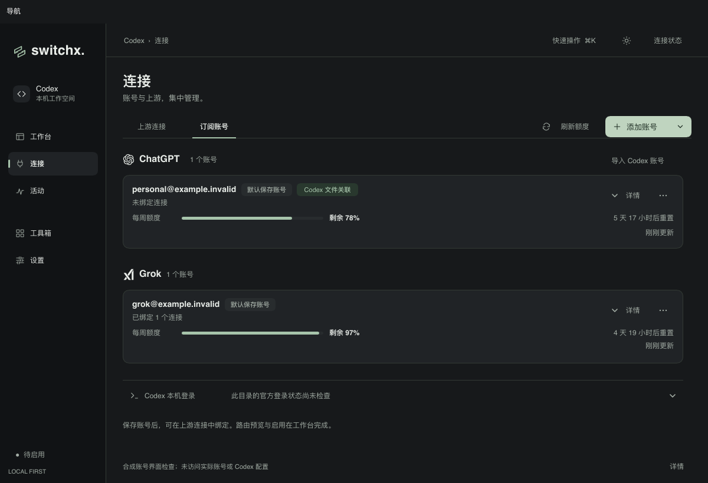
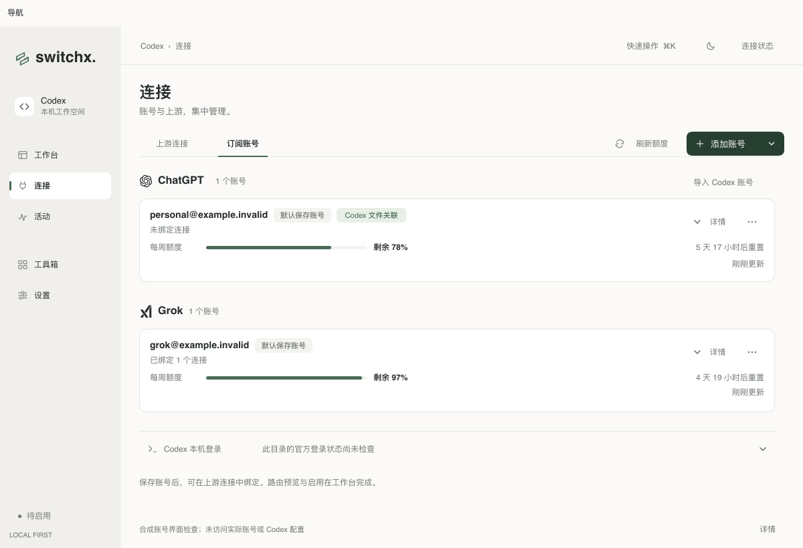
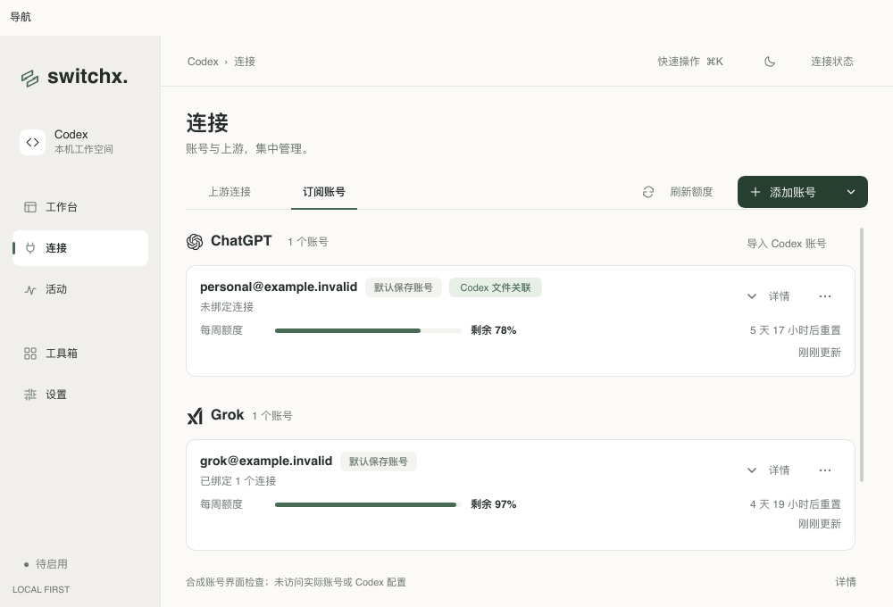
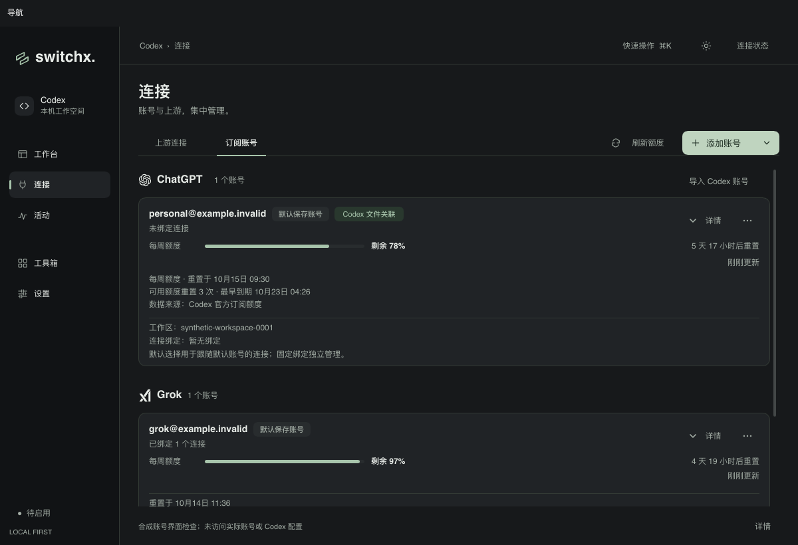
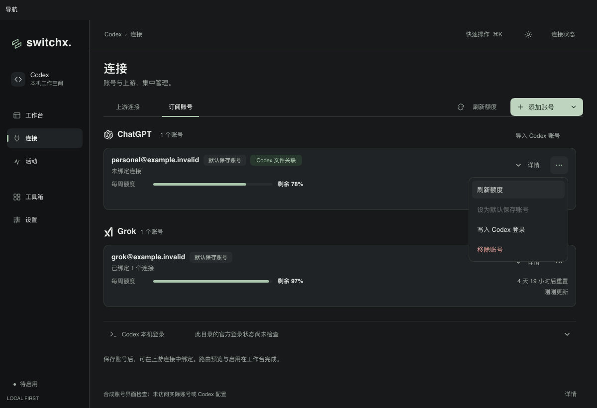
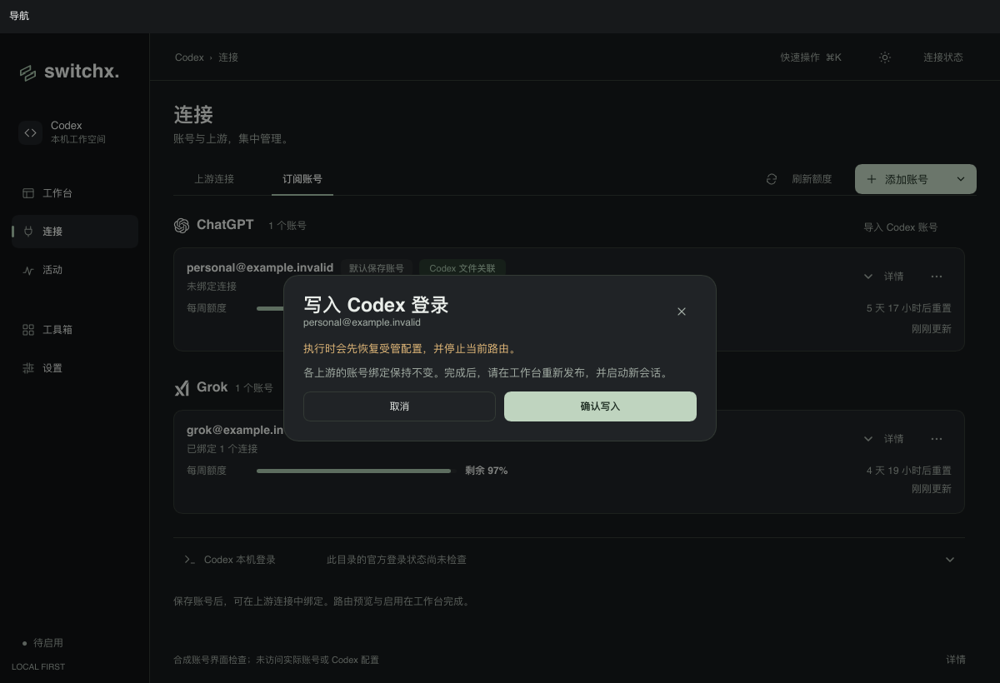

# 订阅账号页与交互动效验收

日期：2026-10-09。正式实现为 Rust + Slint；本记录使用合成账号和 Slint 软件渲染器，未读取实际账号、改写实际 Codex 登录或配置，也未验证真实上游。

## 页面与操作

- ChatGPT 与 Grok 共用账号卡片，展示名称、默认保存账号、文件关联、连接绑定与额度摘要。
- 列表顶部统一添加账号和刷新额度。账号操作归入“更多”，默认标记作为状态显示。
- 重置时间、工作区、绑定连接和额度来源按需展开；查询错误、失效授权及到期警告保持可见。
- 本机登录在列表底部单独折叠；文件关联与官方登录检查分别表述。
- 写入与重新登录先展示恢复配置、停止路由和重新发布的影响，确认后才派发现有操作。
- API 预览入口移动到工作台，沿用原有恢复与预览流程。

## 动效与安全边界

- 复用共享按钮、菜单、抽屉、输入框、额度条与滚动条。新增按钮键盘按压、图标旋转、加载反馈、标签指示线、详情与登录进度展开、账号进入与移除过渡。
- 菜单方向键只移动焦点；回车或鼠标点击才选择操作。关闭动画结束后派发动作，并再次检查启用状态、菜单项权限和账号上下文。
- 确认移除后先收起卡片，再派发一次移除操作；失败或通道关闭后恢复展示。现有账号引用、受管配置与凭据保护仍由原业务逻辑校验。
- 展开状态按账号 ID 保留，额度结果与倒计时更新不会重置详情。快速反向操作从当前动效状态接续。
- 关闭动画或系统要求减少动态效果时，过渡立即完成。复制、编辑、滚动和凭据清理保持原有行为。

## 验证

```sh
make check
cargo run --locked --example provider_icons_preview -- /absolute/output --accounts-design
cargo run --locked --example provider_icons_preview -- /absolute/output --codex-quota
cargo run --locked --example provider_icons_preview -- /absolute/output --xai-quota
sh scripts/bundle-macos.sh
```

`make check` 包含 Rust/Slint 格式、全目标 Clippy 与工作区测试。新增回归覆盖动作菜单的键盘激活、禁用项、账号上下文变化、退出期间取消，以及账号详情和移除动效的中途反向、额度更新与减少动态效果。

最终 `RUST_TEST_THREADS=1 make check` 通过：205 个测试通过、1 个既有测试忽略。并行运行曾出现既有工作区发现取消测试的两秒启动等待超时；该测试单独复核与串行全量通过，未修改账号发现或清理业务代码。本地 Debug 应用包已构建，`Info.plist` 检查通过。

`--accounts-design` 在 1200×820、1000×680 下生成深浅主题的摘要、详情、本机登录与登录确认截图；通过实际点击验证账号菜单只打开写入确认，确认后才派发写入，移除只派发一次。额度探针覆盖多个窗口、单窗口、仅 Credits、额度耗尽、查询中、刷新中、错误、旧数据与重新授权状态。

## 截图












