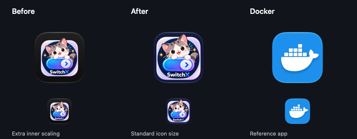

# macOS 应用图标尺寸修复

2026-09-30，本机 macOS 27.0（26A428），本地调试 bundle。

透明原图直接生成 ICNS 时，系统把它当作前景图案，再放入深色底板并缩小。刷新缓存后仍可复现；增加透明留白让内缩更严重。将同一图案合成到不透明方形底稿后，系统使用标准圆角底板尺寸，原图中的主体细节放大约 20%。

`prepare-macos-icon.swift` 在本机 macOS 26+ 上生成带深蓝底色的 1024×1024 sRGB 底稿，再由原有 `sips` / `iconutil` 流程生成 ICNS。较旧构建主机沿用原图。原始优化版 PNG 保留在 `assets/app-icon.png`。

| 指标 | 修复前 | 修复后 |
| --- | --- | --- |
| 原图蓝紫色细节宽度 / 画布 | 73.4% | 73.4% |
| 系统渲染的同一细节宽度 / 画布 | 48.0% | 57.8% |
| 系统渲染 / 原图比例 | 0.654 | 0.787 |
| 原生尺寸检查 | FAIL | PASS |

系统渲染的彩色底板宽度为 80.5%，与本机 Docker 图标一致。



验证命令：

```sh
sh scripts/bundle-macos.sh
swift scripts/check-macos-icon.swift /Users/issuser/Developer/xfy/switchx/target/debug/SwitchX.app
```

另外对 ICNS 做反向解包：10 个标准 / Retina 表示的尺寸均正确，像素均为不透明；原图与用户提供的优化版文件逐字节一致。

使用独立临时 `SWITCHX_DATA_DIR` 和 `CODEX_HOME` 启动实际调试程序，其运行进程图标与通过检查的原生图标服务截图逐字节一致。桌面自动化接口返回 `cgWindowNotFound`，因此对比图来自原生图标服务。测试进程已结束，临时数据目录已清理；本次没有进行真实上游验证。
