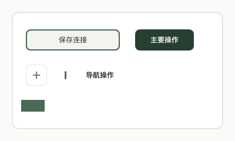
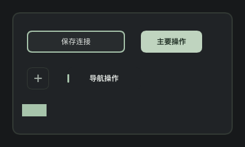

# Slint 构建成本调整（2026-10-08）

## 改动

- `QuietButton` 的外层保留尺寸、属性、焦点、点击和无障碍接口；绘制、透明度及颜色动画放在内部 `Rectangle`。外层不再通过透明度和原生绘制属性动画触发 Slint 的强制内联。
- `SurfaceCard` 保留背景、边框和圆角属性，将绘制及动画放在内部元素，并保留原有子内容插槽和填充尺寸行为。继承它的编辑器因此可以保留独立的生成结构。
- `src/ui.rs` 集中包含生成代码。主程序、模型选择集成测试及两个预览示例引用 `switchx::ui`。库普通构建和库单元测试构建仍可能分别编译；小控件测试继续用 `slint!` 生成自己的测试窗口。
- `[profile.dev] debug = "line-tables-only"` 保留文件及行号信息，减少完整变量和类型调试信息。实际编译命令已核对为 `-C debuginfo=line-tables-only`。
- 没有调整 Cargo jobs、codegen-units、增量编译、工具链或渲染器。

## 生成代码对照

环境为 Apple Silicon macOS、Rust 1.98.1、Slint 1.18.1。冻结同一份 UI 和资源，使用同一个已编译的 Slint 构建脚本分别生成原版及仅替换 `components.slint` 的版本；不混入另一个聊天的 Grok 功能变更。

| 指标 | 改动前 | 改动后 | 减少 |
|---|---:|---:|---:|
| 生成 Rust 字节数 | 24,407,498 | 18,098,229 | 25.8% |
| 生成 Rust 行数 | 244,802 | 162,087 | 33.8% |
| `move` 闭包数量 | 11,875 | 9,004 | 24.2% |
| 函数数量 | 18,721 | 8,552 | 54.3% |

生成结果包含独立的 `InnerQuietButton`，以及 Provider、Subscription、Xai、Model、CommonConfig 编辑器结构。`SurfaceCard` 带子内容的实例仍可能内联；本次收益包含不再将整个编辑器的实现展开到 `AppWindow`。

不同输出路径及编译器内部生成顺序会使实际 `target/` 中的行数和闭包计数有小幅差异。上述数字来自冻结输入的对照；生成字节数不能直接换算成 rustc 内存降幅。

## 行为验证

- `tests/shared_surfaces.rs` 覆盖深浅主题、卡片样式覆盖、按钮点击、Space/Return、程序化焦点、无障碍名称及动作、禁用状态、动画中间帧、关闭动画及系统减少动画偏好。
- 控件测试改动前后 27 张软件渲染画面逐字节一致。
- `provider_icons_preview` 用合成资料渲染完整 UI；1200×820 / 1000×680、深浅主题下 48 张页面及编辑器画面逐字节一致。
- 上述验证没有访问真实账号、数据库或用户 Codex 配置，也没有向真实供应商发送请求。

## 构建内存采样与限制

新配置执行 `cargo build --locked --offline --example provider_icons_preview`，每 200ms 采样该 Cargo 进程树中的 rustc RSS，观测到的最大单进程 RSS 为 2,665.4 MiB（约 2.60 GiB）。这次构建还包含切换调试信息后依赖的重新编译。

改动前同目录有其他聊天在构建，基线命令等待构建锁并复用了其产物，因此没有取得可比较的 rustc 峰值。不能用这两次命令的总耗时或 RSS 给出内存、速度提升百分比。RSS 采样也不等同于 macOS 活动监视器的完整内存占用。

## 检查

- `make format-check`
- `cargo check --locked --offline --all-targets`
- `cargo test --locked --offline`：188 passed，1 ignored；包含同一工作目录中已有的 Grok 合成测试。
- `cargo clippy --locked --offline --all-targets -- -D warnings`
- `git diff --check`

需要完整变量调试信息时，可对单次构建使用 `CARGO_PROFILE_DEV_DEBUG=full cargo build --locked`。
