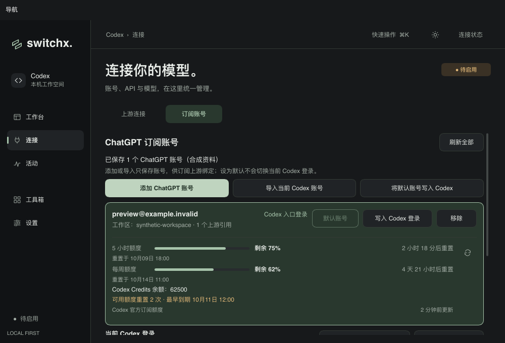
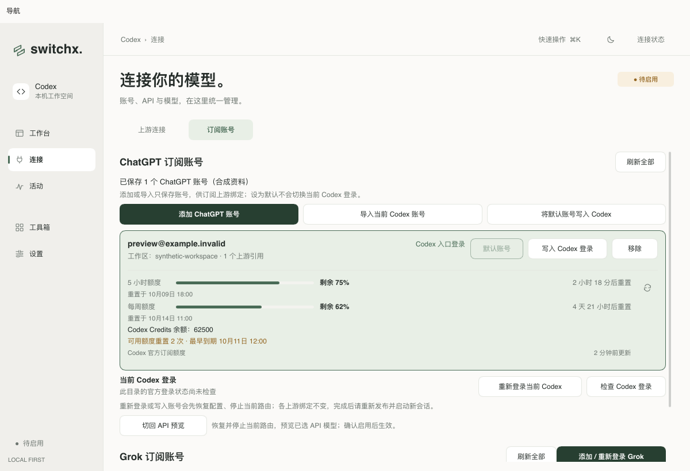
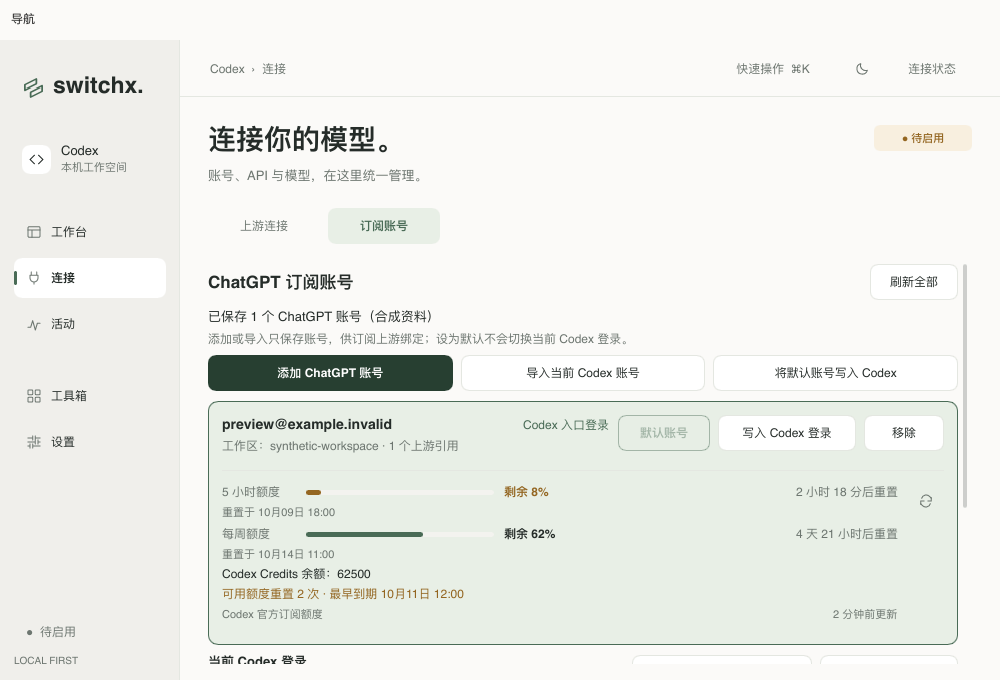
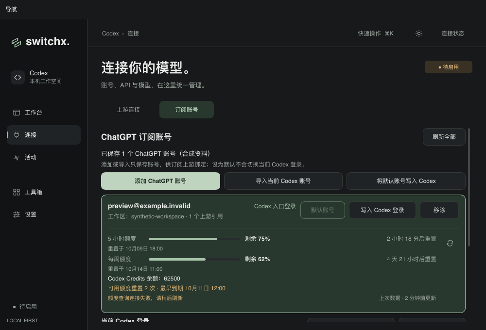

# ChatGPT / Codex 订阅额度（2026-10-09）

参考 `others/cc-switch/src-tauri/src/services/subscription.rs` 和 `commands/codex_oauth.rs`，在「连接 → 订阅账号」的 ChatGPT 卡片中按保存账号显示 Codex 订阅额度。主、副窗口分别显示剩余百分比、进度条、重置倒计时与本地重置时间；窗口名称来自服务提供的时长，包含 5 小时、每周、30 天及其他时长。没有使用比例的窗口不显示，不推断为 100% 剩余。

`wham/usage` 提供时显示正数 Codex Credits 余额；不限量、缺失、无效或为零时隐藏。`wham/rate-limit-reset-credits` 并行、尽力查询可用重置次数及最早到期时间，其失败不影响主要额度。与 CC Switch 一样按仍 available 且未过期的记录计数；无法识别的到期日期丢弃，不推断为永不过期。临近三天到期提示警示色，时间更新会排除已经过期的重置。

进入页面查询一次，新登录或导入后查询；逐账号刷新与“刷新全部”在独立后台任务执行，不占用全局 busy。重复刷新正在查询的账号不会重复提交。失败保留上次成功快照并显示错误和“上次数据”；删除、重新登录、导入和新的查询不会接收旧结果。快照只保存在内存里，时间每 30 秒更新，不轮询账单接口。GPT 与 Grok 共用额度进度条组件，保持主题、警示色和无障碍语义一致。

查询使用所选保存账号的 access token 和 `ChatGPT-Account-Id`，固定请求 `https://chatgpt.com/backend-api/wham/usage` 和 `https://chatgpt.com/backend-api/wham/rate-limit-reset-credits`。禁用重定向，响应限 64 KiB，主要/附带请求分别限 15/8 秒。网络、HTTP、解析错误不会显示原始响应正文、凭据或请求地址。

额度查询不启用路由、不发送模型推理请求、不切换或写入原生 Codex 登录与配置。复用账号凭据刷新及轮换保护，续期只落盘私有账号文件；目标 Codex 目录尚不存在时不创建它。原生登录与该账号共用需要续期的凭据时，提示先显式检查并续期原生登录，避免后台查询轮换凭据后留下过期的原生文件。

## 验证

- `cargo test --locked quota`：模拟账单解析、时间窗口、可选余额、重置到期、凭据隔离、重定向拒绝、响应大小限制及错误脱敏。两个保存账号通过同一生产账号管理器分别续期、查询，保持另一原生账号的 `auth.json`、`config.toml` 与归属标记字节不变；不存在的目标目录不创建；共享的过期原生凭据被拒绝且文件不变。
- 桌面状态测试：后台查询不占用全局 busy，去重刷新，保留旧值，更新倒计时，重新登录的账号代次丢弃旧快照，删除及过时查询不回写，队列失败恢复刷新按钮。
- `make check`：Rust / Slint 格式、全目标 Clippy 与完整测试通过，203 个测试通过，1 个需要本机 Codex 的目录解析测试按原配置忽略。
- `cargo run --locked --example provider_icons_preview -- /absolute/output --codex-quota`：44 张生产 Slint 合成截图，覆盖深浅主题、1200×820 / 1000×680、双窗口、单窗口、30 天窗口、仅 Credits、多账号、低额度、用尽、首次加载、刷新中、失败及旧值保留。额外像素检查确认短进度条从左侧开始。
- `cargo run --locked --example provider_icons_preview -- /absolute/output --xai-quota`：32 张既有 Grok 场景与进度条像素断言通过，验证共用组件未破坏原有显示。

## 真实账单查询

通过 `codex_quota_probe` 显式指定已有账号数据目录及原生 Codex 目录，默认保存的 ChatGPT 账号官方账单查询成功。返回一个额度窗口和可用重置记录，当前未提供正数 Credits 余额；原生登录、配置及归属标记未改变。真实比例、余额、重置日期及账号身份不保存到仓库。

这是生产账号管理器到官方账单接口的验证。界面截图使用合成账号；本轮没有验证真实模型推理权限，也没有执行额度重置兑换。

## 合成界面截图

