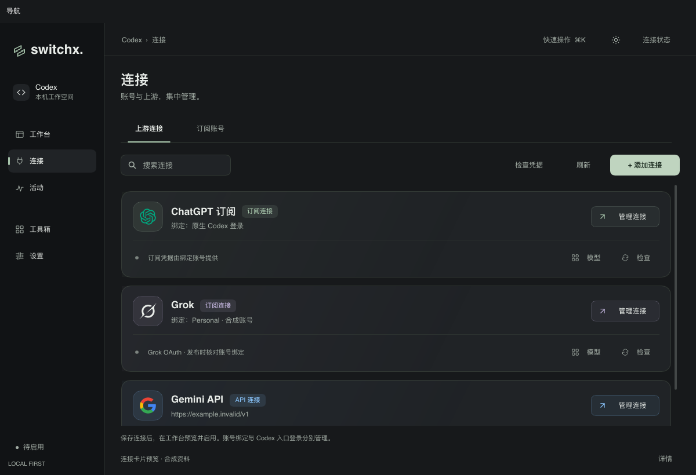
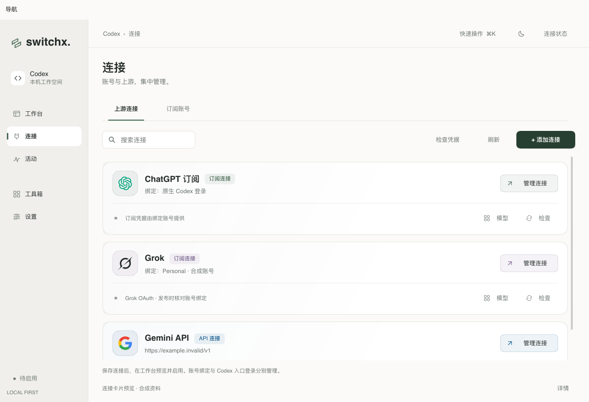
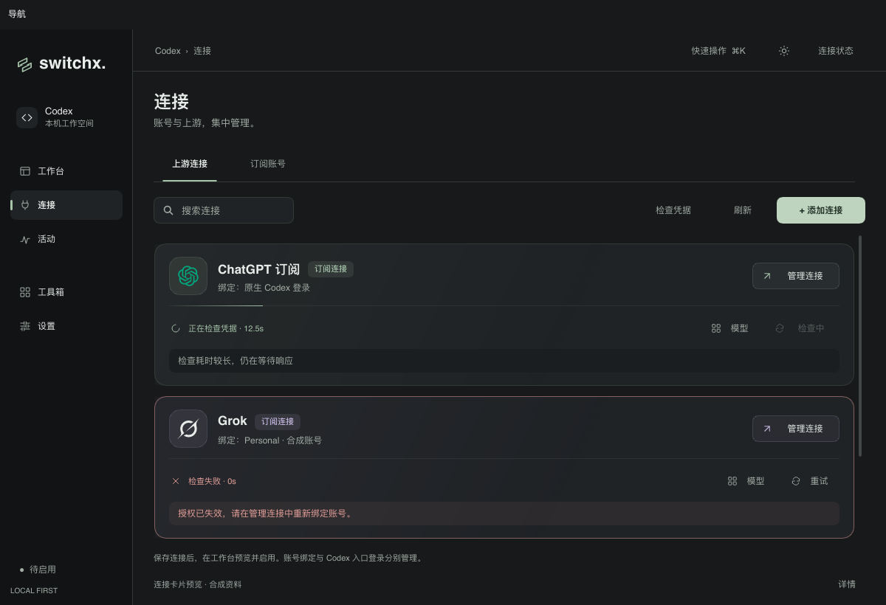
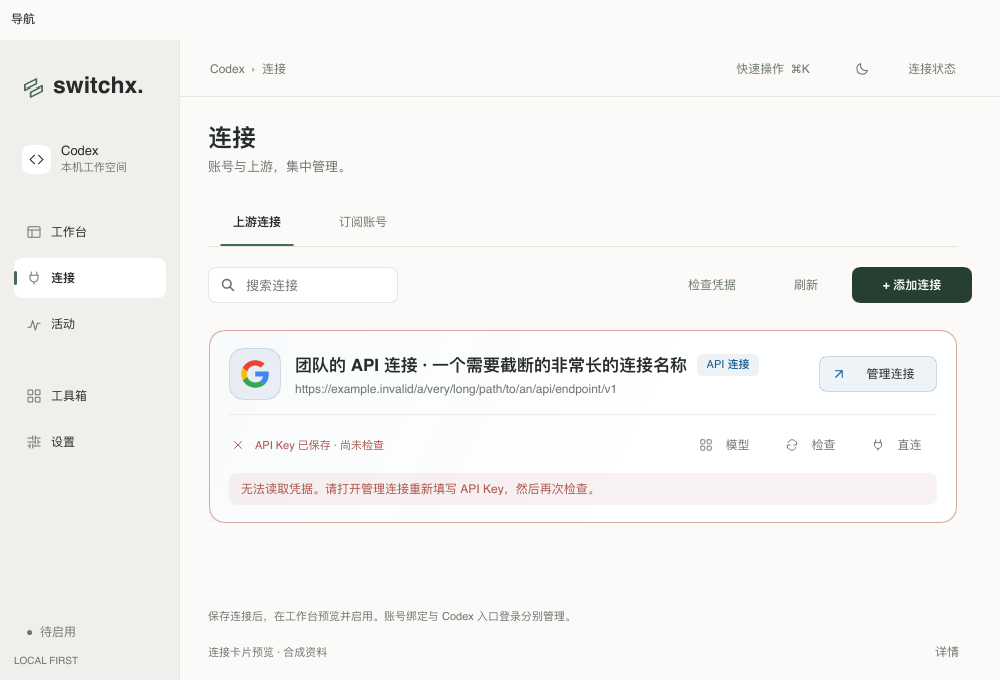

# 上游连接卡片与动效

连接卡片改为品牌信息与操作状态两层：52 px 图标底座、名称和类型标记、账号绑定或端点、独立管理入口，以及下方检查状态、模型、检查与 API 直连操作。ChatGPT、Grok 与 API 使用绿、淡紫、蓝色点缀，卡片采用细边框、柔和渐变和阴影。长名称和端点自动截断，错误详情换行展示。

动效包括卡片错峰淡入与上移、悬停抬升、图标轻微上移、边框和背景过渡、共享按钮按压反馈、检查中的旋转图标与流动分割线，以及错误提示展开。抬升不改变列表布局；关闭动画或系统减少动态效果时停止运动。检查结果仍只描述既有凭据检查结果，不代表真实上游请求已通过。

连接列表按 ID 更新已有行，复用账号列表的同步实现，避免进度刷新重建卡片、反复播放入场动画或丢失滚动位置。保留受管配置、全局忙碌、重复检查及登录中的操作限制。

## 验证

```sh
RUST_TEST_THREADS=1 make check
cargo run --locked --example provider_icons_preview -- /tmp/switchx-connection-cards --connections-design
cargo run --locked --example provider_icons_preview -- /tmp/switchx-connection-cards --connections-native
sh scripts/bundle-macos.sh
```

合成预览覆盖 1200×820、1000×680、深浅主题，以及正常、悬停、检查中、错误、长名称和受管状态。原生 macOS 窗口已核对深浅主题、悬停外观、检查中到完成的反馈和滚动条操作。原生预览使用合成检查回调，未读取用户账号、写入 Codex 配置或请求真实上游。

`shared_surfaces` 逐帧检查入场、悬停不重排、所有卡片按钮可达、禁用限制、检查动画、减少动态效果和错误详情。现有桌面回归改为点击新位置，并断言检查进度更新保留列表实例；继续验证一条连接检查时其他连接可操作。

最终 `RUST_TEST_THREADS=1 make check` 通过：Rust/Slint 格式、全目标 Clippy、209 个测试通过，1 个既有测试忽略。

## 截图








