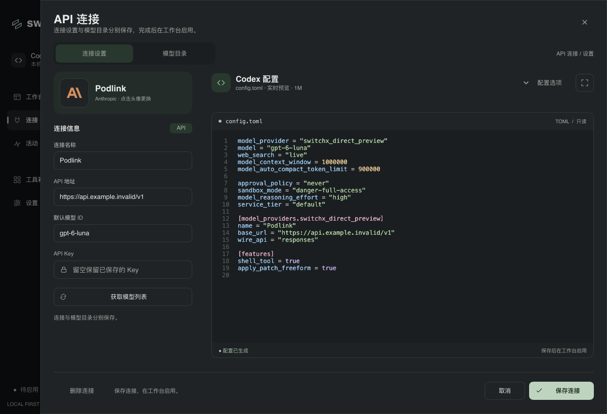
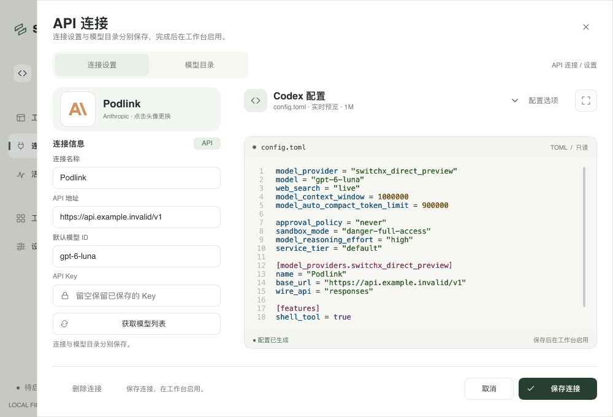
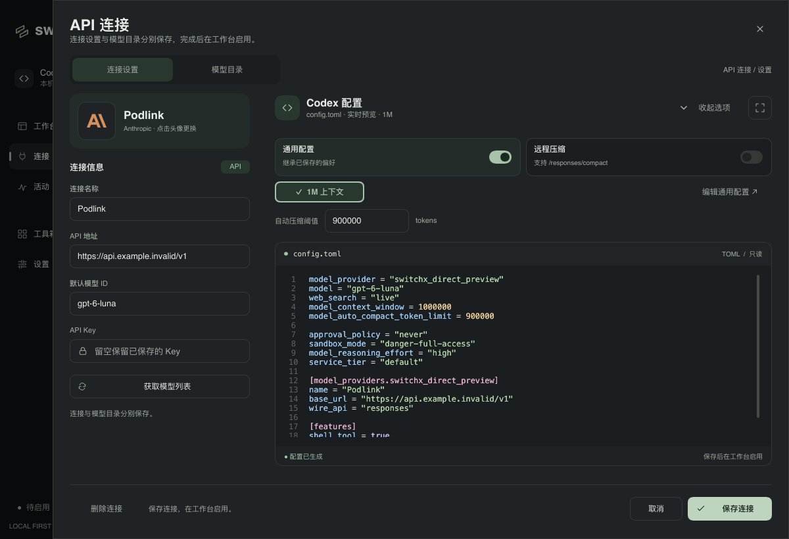
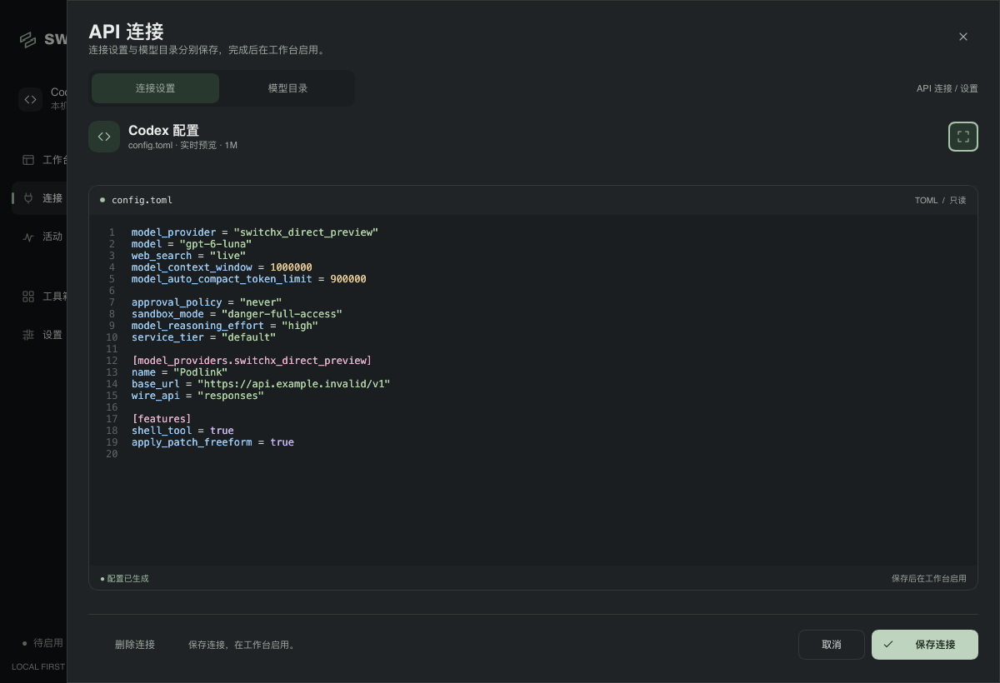
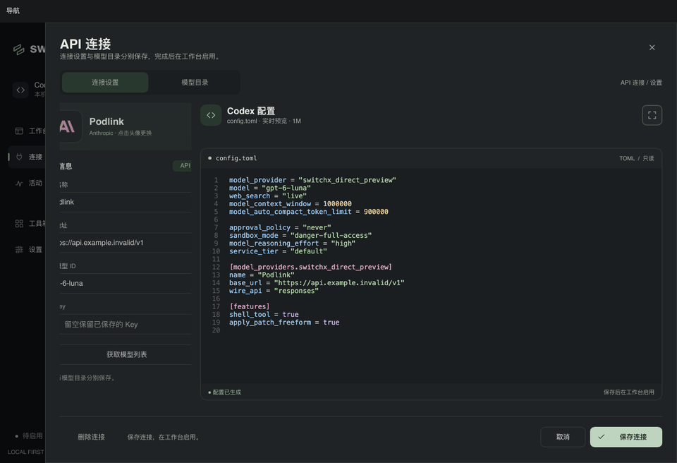

# API 连接设置重设计

API 设置改成双栏工作区。左侧集中显示连接头像、名称、地址、默认模型和遮罩 Key 输入，右侧提供独立的 config.toml 预览。抽屉加宽至最多 1120px，在 1000px 窗口中保留 60px 的外部空间。保存、取消和删除确认固定在底部，不随表单滚动。

配置选项默认收起，通过标题旁的“配置选项”展开通用配置、远程压缩和 1M 上下文设置。通用配置和远程压缩使用整行可点击、可键盘操作的滑动开关。开启 1M 后压缩阈值渐进展开。所有修改继续通过现有回调实时生成配置，不改变配置发布和账号绑定行为。

预览增加文件标题、行号、只读提示和生成状态。1200×820 窗口中的代码编辑区从 208px 增至约 420px；1000×680 中约为 280px，且无需滚动整个抽屉才能访问保存操作。“放大配置预览”收起左侧表单和选项，将预览展开到抽屉内容的全宽，再次点击恢复。

模型获取反馈显示在右侧；新连接的获取结果自动切换到模型选择区域，并可随时返回配置预览。原有搜索、全选、默认模型选择和保存时附带映射行为继续使用现有组件。

## 动效和凭据边界

- 顶部连接设置 / 模型目录使用滑动指示器。
- 连接名片与配置工作区延迟淡入，开关滑块带轻微回弹。
- 配置选项和压缩阈值平滑展开 / 收起，展开箭头旋转。
- 预览宽度、表单淡出和选项收起同步过渡；中途反向切换保持布局连续。
- 动效使用 Theme 时长，关闭动画或启用减少动态效果时直接呈现最终状态。

Key 输入保持遮罩，保存、取消、关闭和既有导航清理路径不变。删除仍需二次点击确认，配置生成失败时禁止保存。配置预览不增加凭据内容。保存 API 连接继续沿用原有存储逻辑，不自动启用 Codex。

## 验证

```sh
make check
cargo build --locked --bin switchx --example provider_icons_preview
target/debug/examples/provider_icons_preview /tmp/switchx-editor-final --provider-editor-design
sh scripts/bundle-macos.sh
```

`make check` 通过 Rust / Slint 格式、全目标 Clippy 和 226 项测试，1 项既有测试忽略。按主分支移除顶部菜单后的布局更新连接选择测试和合成预览坐标，继续覆盖返回选择时清空 Key 的行为；保留模型获取反馈从首帧开始的动画修复。

合成预览覆盖 1200×820、1000×680、1600×1000 的深浅主题，以及配置选项、关闭上下文、全宽预览、配置错误和新连接模型选择。交互断言覆盖滑动开关、上下文设置、模型获取、保存 / 取消可达性、凭据草稿清空、删除二次确认和无效配置禁止保存。动画检查覆盖宽度变化、反向切换和两种减少动态效果设置。

截图和动效来自 Slint 软件渲染，使用合成地址、配置和 Key，不读取真实账号或写入用户 Codex 配置。原生预览进程启动成功，但窗口工具返回 `cgWindowNotFound`，因此没有取得 macOS 合成器截图；软件渲染不代表原生窗口截图或真实上游验收。

## 截图










