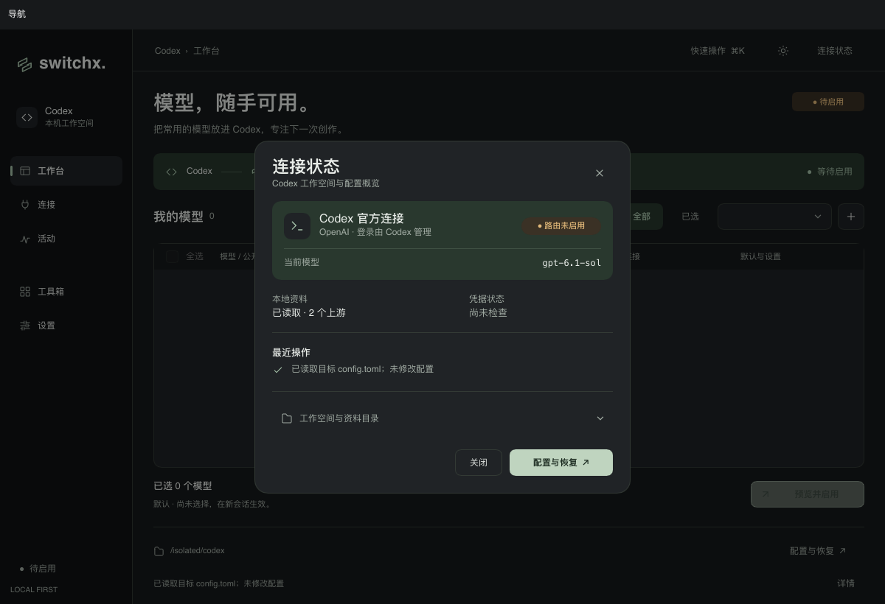
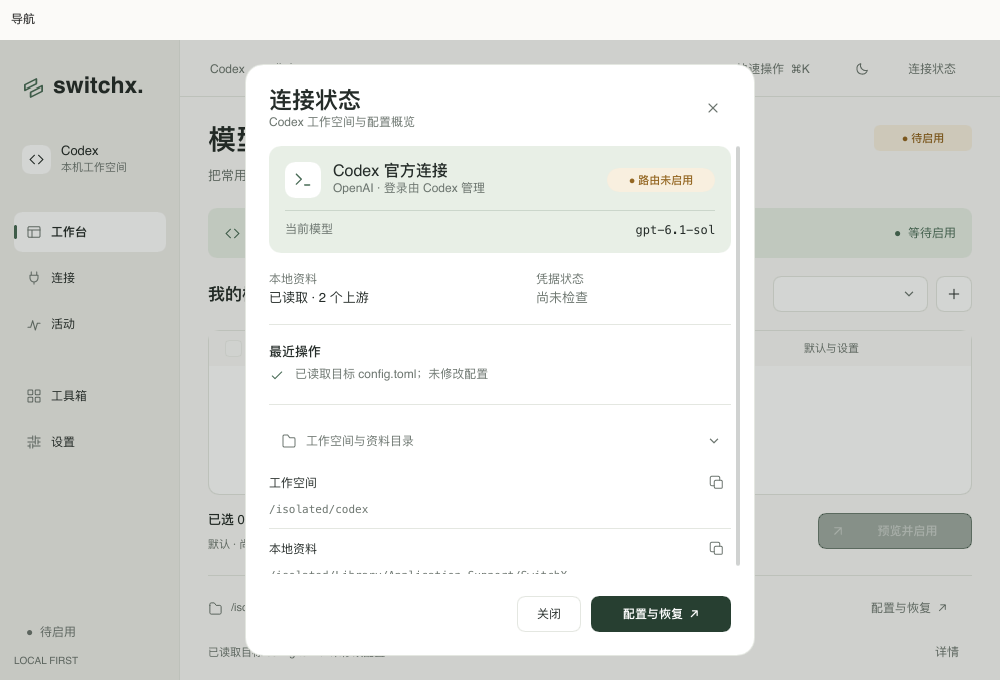

# 连接状态紧凑弹窗验收

日期：2026-10-09。采用设计预览中的「紧凑弹窗」方案。

连接状态改为居中、按内容决定高度的弹窗。顶部集中显示配置中的连接方式、提供方和当前模型，下方展示本地资料、凭据检查状态和最近操作。当前模型来自已读取的 Codex 配置，与工作台中选中的默认发布模型分别维护。

工作空间与资料目录默认折叠，每次重新打开弹窗都会回到折叠状态。展开后可复制完整路径，使用 Slint 自带的剪贴板功能。内容超出窗口时只滚动正文，底部关闭、配置入口及托管配置的恢复操作保持可见。

处理中禁止关闭、点击遮罩退出和恢复配置。原有恢复回调及配置页入口继续使用；这次改动没有新增配置写入或凭据检查操作。

## 验证

- `make check` 通过：197 项测试通过，1 项需要本地 Codex CLI 的目录解析检查按仓库规则忽略；格式和 Clippy 检查通过。
- 原生软件渲染覆盖深浅主题、`1200×820` / `1000×680` 窗口，以及折叠、展开、待恢复、处理中四种状态，共 16 张预览。
- 同一预览命令验证目录展开、两种完整路径复制、配置页跳转、恢复回调目标、重新打开后折叠、Esc 与遮罩退出，以及处理中禁止恢复和退出。剪贴板与恢复回调均使用合成环境。
- 摘要卡与底部按钮的右边缘通过像素比较，偏差为 0px。其余页面的 28 张预览与修改前逐字节一致。
- macOS 本地应用已检查实际状态绑定、目录展开、Esc 关闭和重新打开后折叠。重启前后 Codex 配置与登录文件的摘要一致。

复现预览与交互检查：

```sh
cargo run --locked --example provider_icons_preview -- /tmp/switchx-status-preview --connection-status
```

完整检查：

```sh
make check
```

以下截图全部使用合成资料，不代表上游请求或登录生命周期验收。




