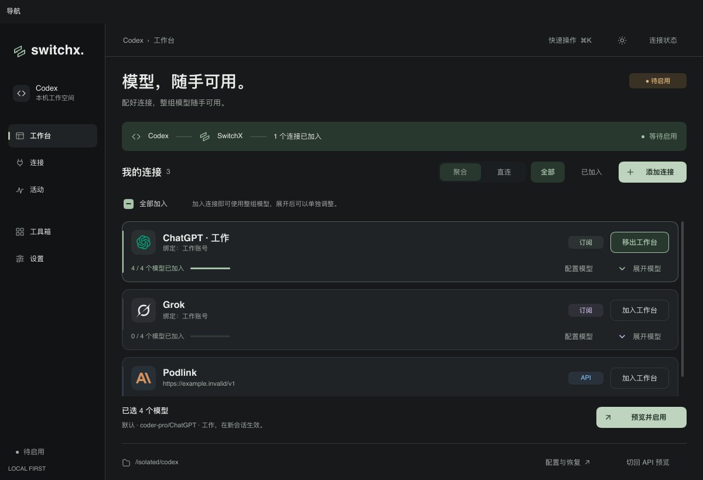
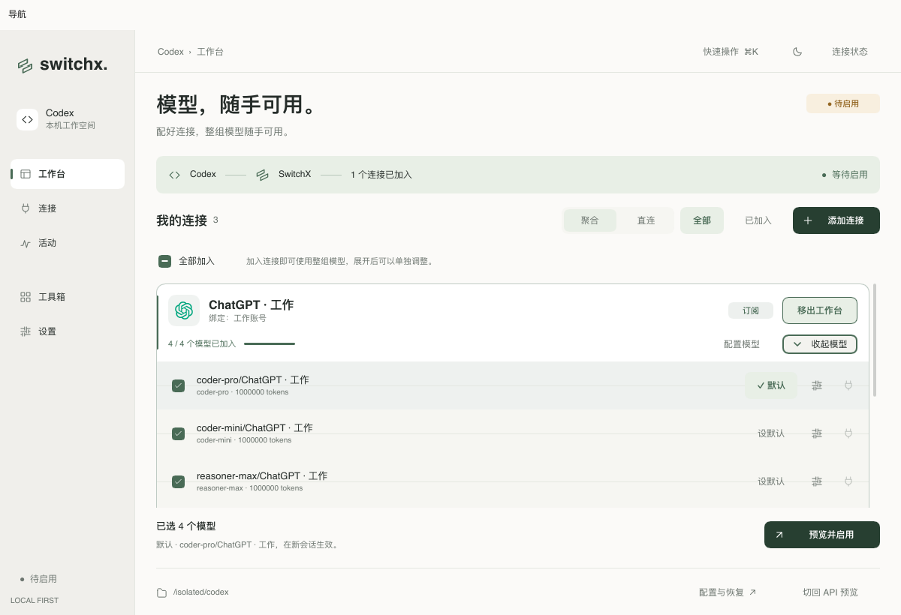
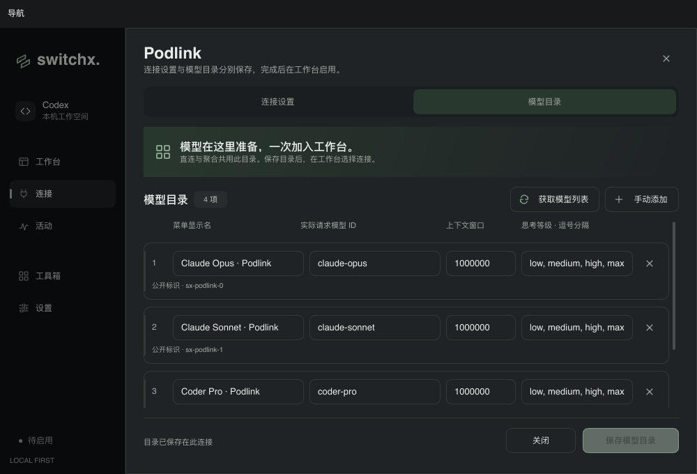
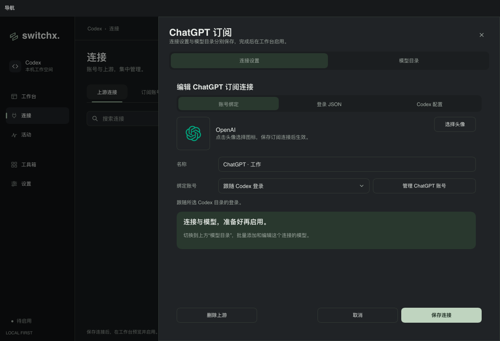
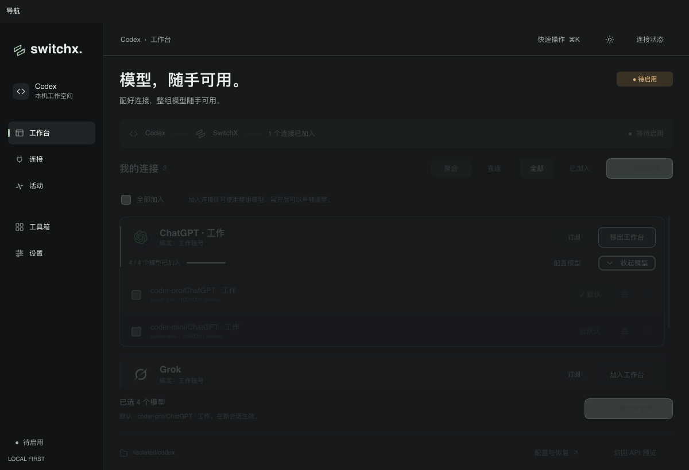

# 连接模型目录与工作台

连接承担模型准备，工作台承担启用。API、ChatGPT 与 Grok 共用连接抽屉中的“模型目录”，可以获取列表批量加入目录、编辑显示名 / 实际请求模型 / 上下文 / 思考等级、手动添加 API 或 Grok 模型，以及移除与撤销。ChatGPT 新条目必须来自官方模板，修改时保留模板中的能力、指令与未知字段。目录与连接设置分别保存；新建连接的“保存并配置模型”会直接打开目录。订阅设置默认显示账号绑定，登录 JSON 与 TOML 各有独立页签。

工作台按连接显示品牌卡片，不再提供逐个选择上游的添加模型菜单。加入连接一次选中全部可发布模型；部分选中时提供“全部加入”，也能整组移出。展开后仍可单独选择模型、设置默认、编辑映射和备用连接。刷新按 ID 更新已有连接与模型行，保留展开状态和滚动位置。

聚合使用已有公开 ID 与精确路由；API 直连使用同一连接目录，发布实际上游模型 ID，并保留显示名和模型能力。直连预览不创建文件，启用时才写入私有目录与恢复 journal；目录修改会使旧预览失效，恢复冲突期间保留目录，成功恢复后删除生成文件。OAuth 订阅保持现有本地路由通道。

目录编辑在内存中保存草稿，保存时一并校验、原子替换，并在事务中比对打开时的快照，避免覆盖外部修改。原有模型保留公开 ID、工作台选择与兼容的备用映射；新增模型默认不加入工作台。编辑连接设置不会重新添加用户已从目录移除的预设模型。切换到模型目录会清空 API Key 和订阅 auth.json 草稿，不写入 Codex 原生登录。

## 动效

- 连接卡片错峰入场、悬停抬升、边框与选中进度过渡。
- 模型展开 / 收起、箭头旋转、默认模型背景反馈。
- 聚合 / 直连、连接设置 / 目录、订阅设置页签的滑动指示。
- 目录行错峰淡入、获取结果展开 / 收起、加载图标旋转。
- 移除条目收缩、撤销展开，以及按钮悬停、按压和焦点反馈。

动效沿用 Theme 时长；关闭动画或系统减少动态效果时直接呈现最终状态。

## 验证

```sh
make check
cargo build --locked --example provider_icons_preview
target/debug/examples/provider_icons_preview /tmp/switchx-connection-redesign-20261010 --connection-workbench
sh scripts/bundle-macos.sh
```

新增检查覆盖目录原子保存、无效 / 重复模型回滚、身份和选中状态保留、外部修改冲突、官方模板保留、未知官方模型拒绝、直连实际 ID 目录、预览无文件、恢复冲突保留与成功恢复清理，以及工作台打开目录时的导航 / 凭据清理和整组选择命令。

合成 Slint 软件渲染检查 1200×820、1000×680 的深浅主题、卡片展开、直连视图、目录移除与撤销、保存按钮可达性和动画帧变化。这些检查不读取真实账号，不修改用户 Codex 配置，也不发送真实上游请求；没有将软件渲染等同于 macOS 合成器或真实供应商验收。

最终 `make check` 通过：Rust / Slint 格式检查、全目标 Clippy、222 个测试通过，1 个既有 CLI 测试忽略。合成预览的整组操作、移除 / 撤销、保存可达性和动画帧变化断言通过，本地 `target/debug/SwitchX.app` 构建完成。

## 截图










