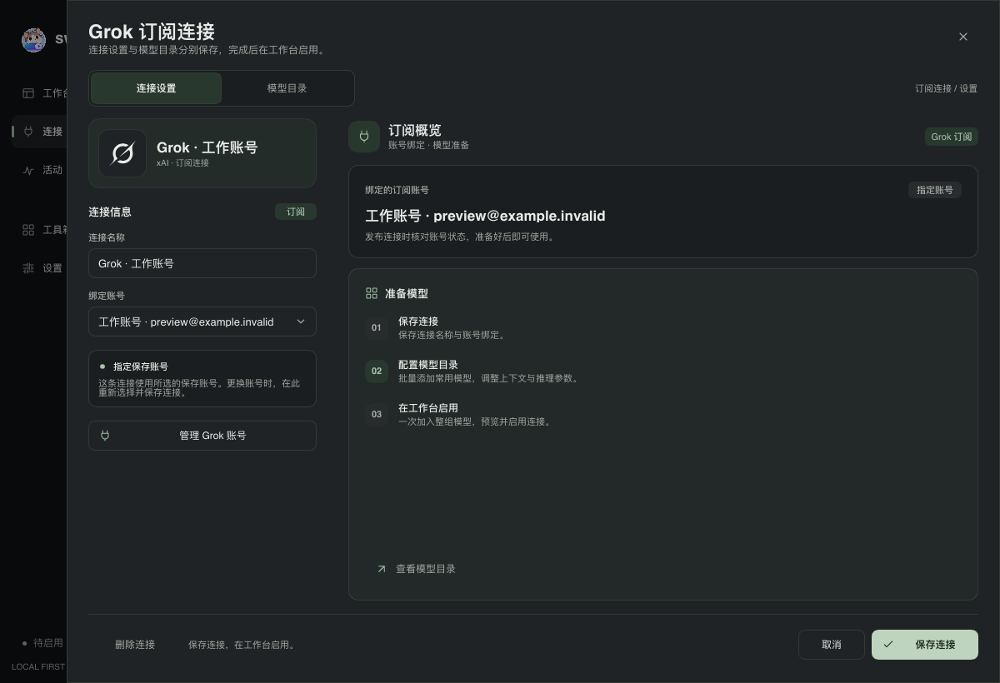
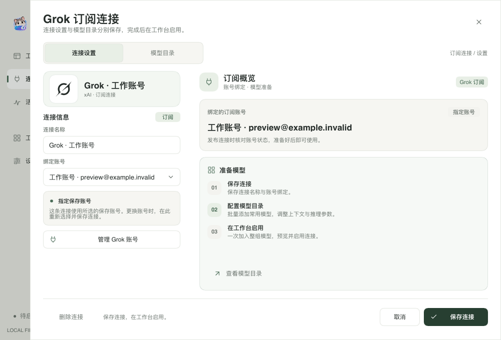
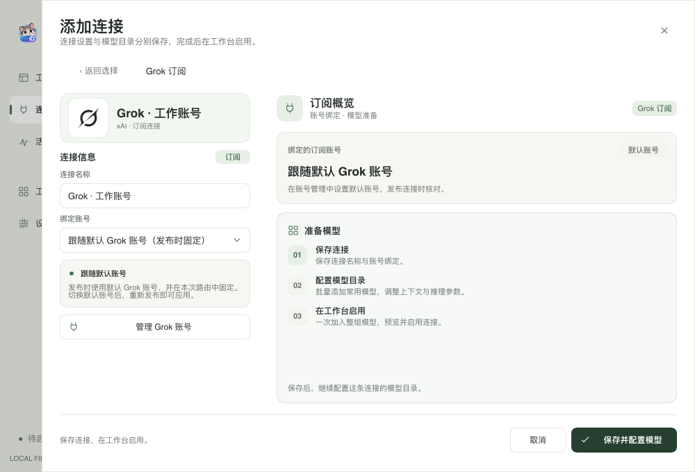
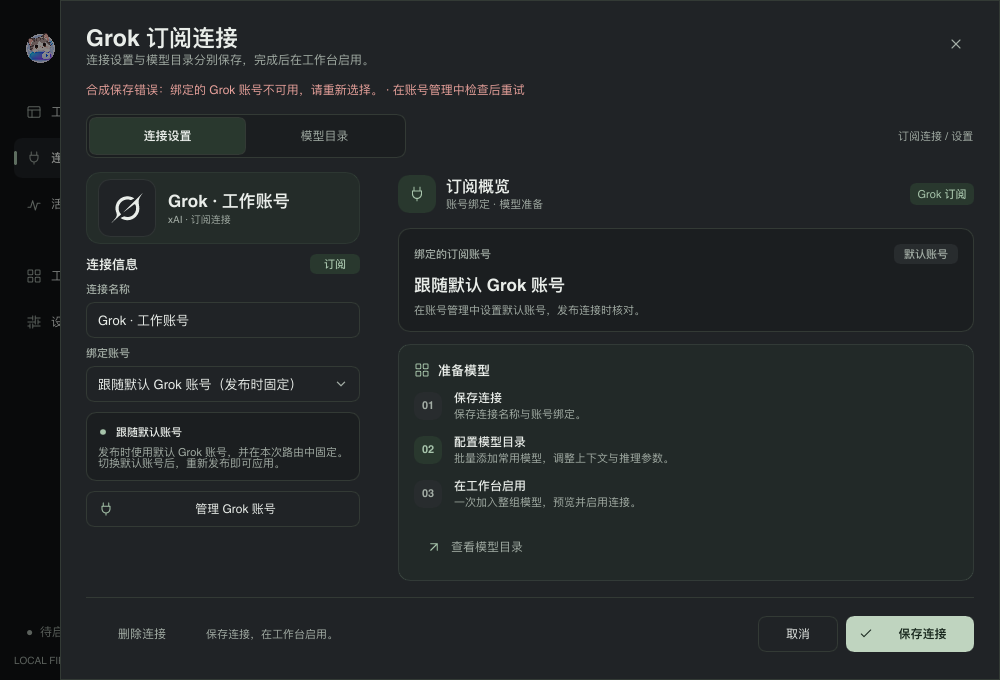
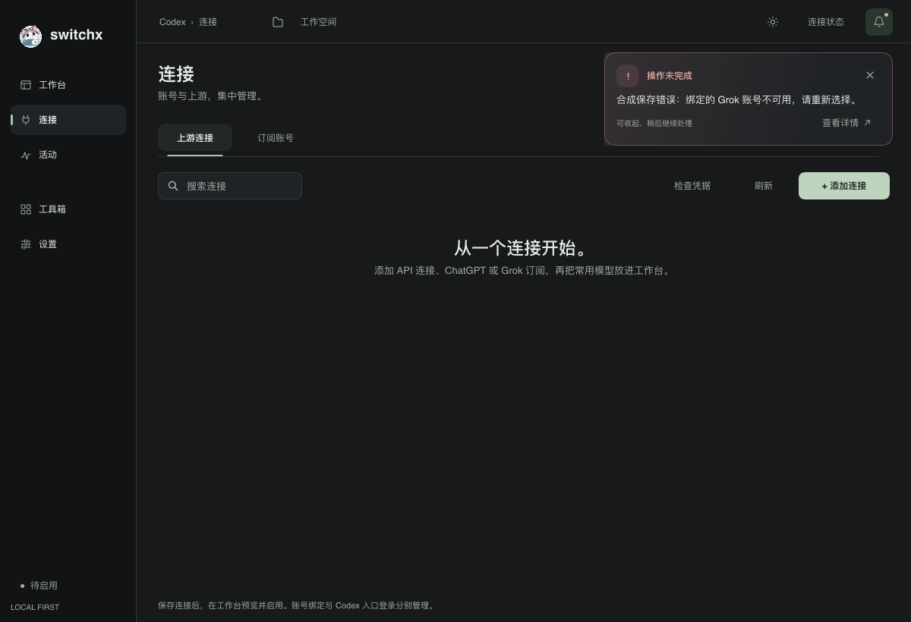

# Grok 订阅连接页重设计

Grok 设置沿用 ChatGPT 订阅页的双栏布局。左侧集中显示 Grok 标识、连接名称、账号选择和绑定说明；右侧显示当前绑定方式与“保存连接 → 配置模型目录 → 在工作台启用”的步骤，已保存的连接可以直接进入模型目录。抽屉最大宽度为 1120px，1000px 窗口保留 60px 的外部空间。

保存、取消和删除确认固定在底部。表单、标识卡片和概览复用 ChatGPT 页的分段入场与账号切换提示动效；关闭动画或启用减少动态效果时直接显示最终状态。Grok 标识是静态信息，不提供头像选择操作。

跟随默认账号与指定保存账号有独立的说明。保存仍只记录连接名称与账号绑定；模型目录与工作台启用继续使用现有流程。错误信息由抽屉统一展示。本次不增加 OAuth 内容展示，也不改动凭据存储、原生 Codex 登录或路由实现。

## 验证

```sh
make check
cargo build --locked --example provider_icons_preview
target/debug/examples/provider_icons_preview /tmp/switchx-grok-editor --xai-editor-design
target/debug/examples/provider_icons_preview /tmp/switchx-chatgpt-regression --subscription-editor-design
target/debug/examples/provider_icons_preview /tmp/switchx-navigation-regression --connection-picker-motion
```

`make check` 通过 Rust / Slint 格式检查、全目标 Clippy 和 229 项测试，1 项既有本地 CLI 检查保持忽略。本次在独立的 `/tmp/switchx-dec2-target` 构建目录验证，避免影响其他工作区的编译。

合成预览覆盖 1200×820、1000×680、1600×1000 的深浅主题、指定账号、默认账号、新建连接、保存中、受管配置和保存错误。交互断言覆盖键盘选择账号、管理账号、模型目录入口、保存与取消、删除二次确认和受管配置下禁止修改；动效检查覆盖入场、账号切换和两种减少动态效果设置。ChatGPT 订阅页与连接选择导航的原有合成检查通过。

截图来自真实 Slint 组件的软件渲染，使用合成账号，不读取真实登录文件，也不写入用户 Codex 配置。它们不代表 macOS 原生窗口截图或真实上游验收。

## 截图










