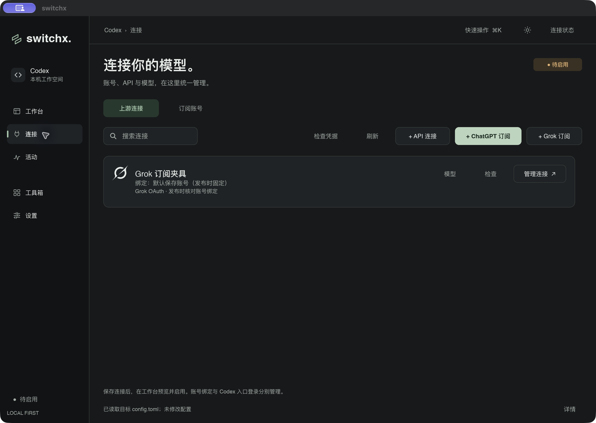
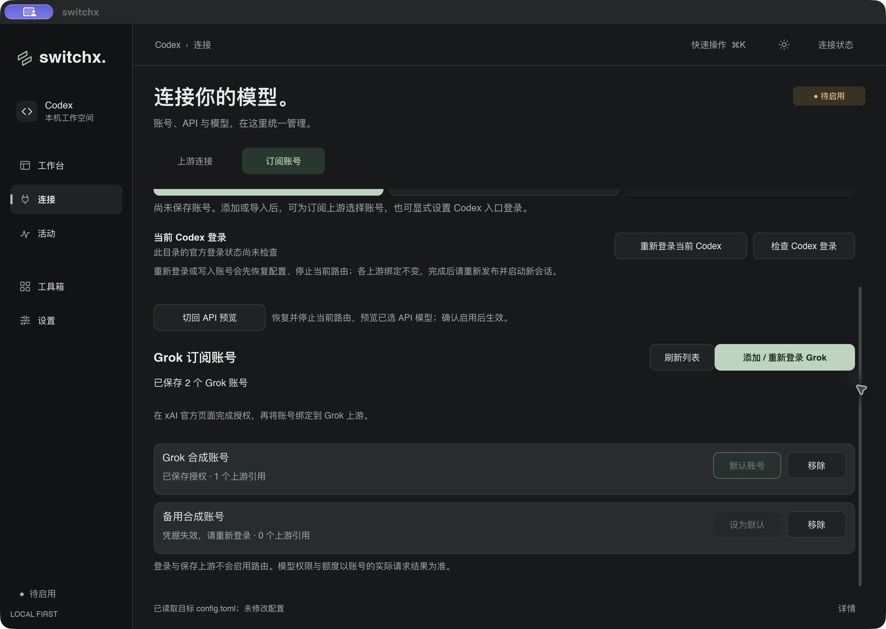
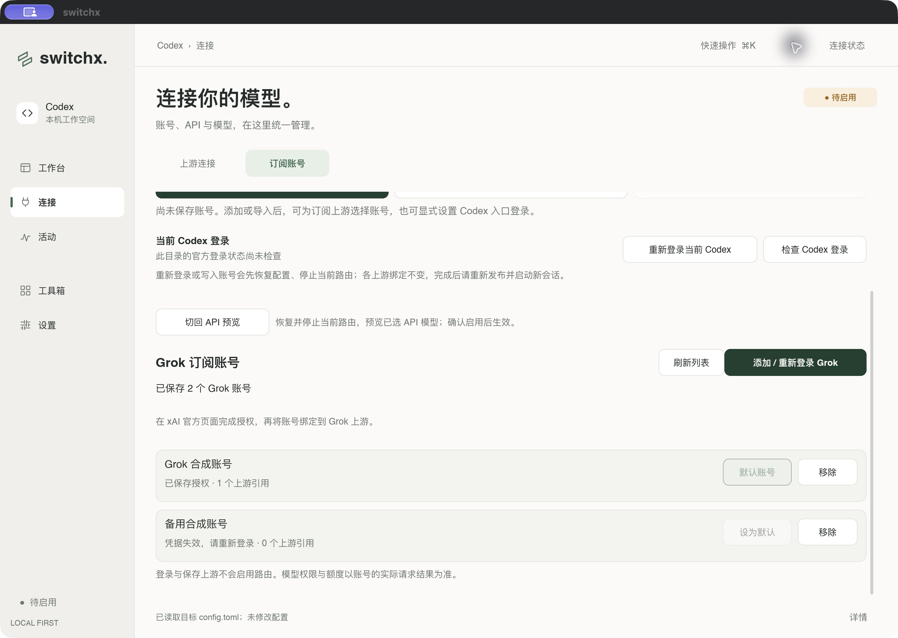
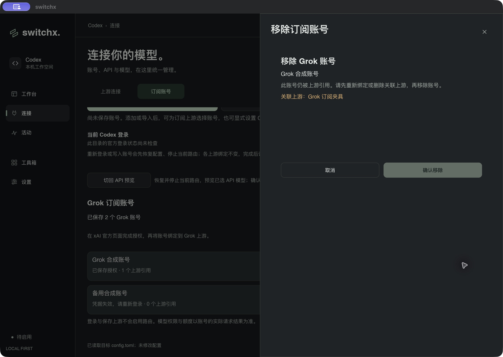
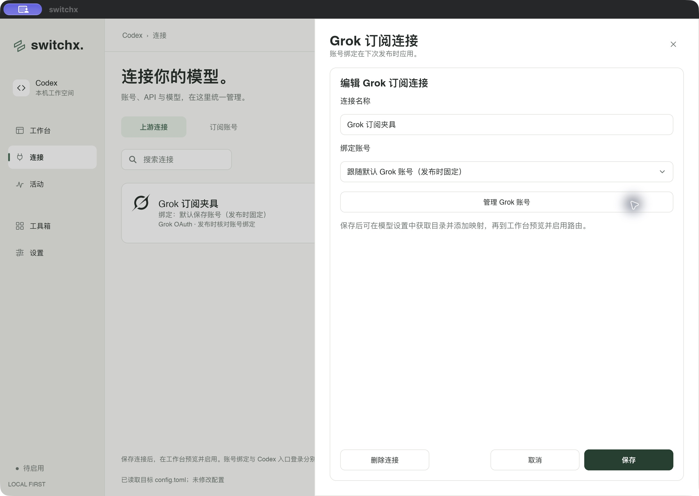

# Grok OAuth 与上游路由验收（2026-10-08）

本次实现设备码 OAuth、多账号管理、默认 / 固定账号绑定、模型发现与原生 xAI Responses 路由。验证使用合成凭据和本地模拟服务器；隔离 Codex CLI 版本为 0.161.0。真实 Grok 登录、订阅权限、配额、实际模型和续期仍待真实账号验收。

## 自动验证

- `make format-check`：Rust 和所有 Slint 文件通过。
- `cargo clippy --locked --all-targets -- -D warnings`：通过。
- `cargo test --locked`：完整测试通过，保留一项需要本机 CLI 的忽略测试。
- `cargo test --locked --test router xai`：三项 Grok 路由检查通过，覆盖 OAuth / OpenAI / 本地令牌隔离、工具名称还原、加密思考回传的会话和模型边界、删除账号、401 / 403 / 429 脱敏、Retry-After 与不重放推理请求。
- OAuth 单元测试覆盖设备码等待和取消、私有文件权限、同一身份重新授权、默认绑定、刷新串行化、失效状态、撤销后的拒绝、取消后完成 token rotation，以及外部写入期间拒绝覆盖。
- schema v10 → v11 测试覆盖旧凭据、模型和备用引用、供应商选项与历史会话记录；未完成配置恢复前禁止迁移。

## 隔离 Codex CLI

```sh
cargo build --locked
cargo run --locked --example xai_cli_probe
```

本地认证和上游只监听 IPv4 loopback；生产 `RouteSession` 路径负责模型核对、本地令牌、目录发布和配置恢复。探针在临时 `CODEX_HOME` 内完成真实 CLI 工具执行，第二轮携带 `function_call_output` 与合成的加密思考内容。请求中的 namespace 工具展平，上游输出还原为 Codex 工具名。探针预置 `model_reasoning_effort = "max"`，验证发布时按 Grok 模型资料改为 `high`，恢复后还原 `max`；并核对工具输出含有真正读取的夹具文件内容。

探针通过后原配置恢复，Codex `auth.json` 保持缺省，恢复记录和本地令牌被清理；临时目录在退出时删除。探针不访问真实 Grok 推理端点。既有恢复逻辑会将 TOML 模型字段的单引号规范为双引号；最终探针使用项目已有的双引号夹具格式做字节比较。

## 原生 macOS 界面

通过 `cargo run --locked --example xai_cli_probe -- --desktop` 打开独立的 `SWITCHX_DATA_DIR` / `CODEX_HOME`，包含一个有效账号、一个失效账号和一个未启用的 Grok 上游。界面检查确认：

- Grok 添加入口、连接图标、独立编辑器和账号管理区可达。
- 默认 / 固定账号可选；失效账号不会进入可用选择器，不能设为默认。
- 保存固定账号绑定后退出编辑器；配置没有启用，模型保持未选中。
- 被上游引用的账号显示引用名称，确认移除按钮禁用，标题为 Grok。
- 账号页面可通过无障碍滚动条操作滚动；深浅主题下内容和按钮可读。
- Esc 关闭编辑器；设备码登录本身由模拟自动测试验证，本次未在原生界面发起真实授权。
- 夹具进程退出后临时目录已删除。










