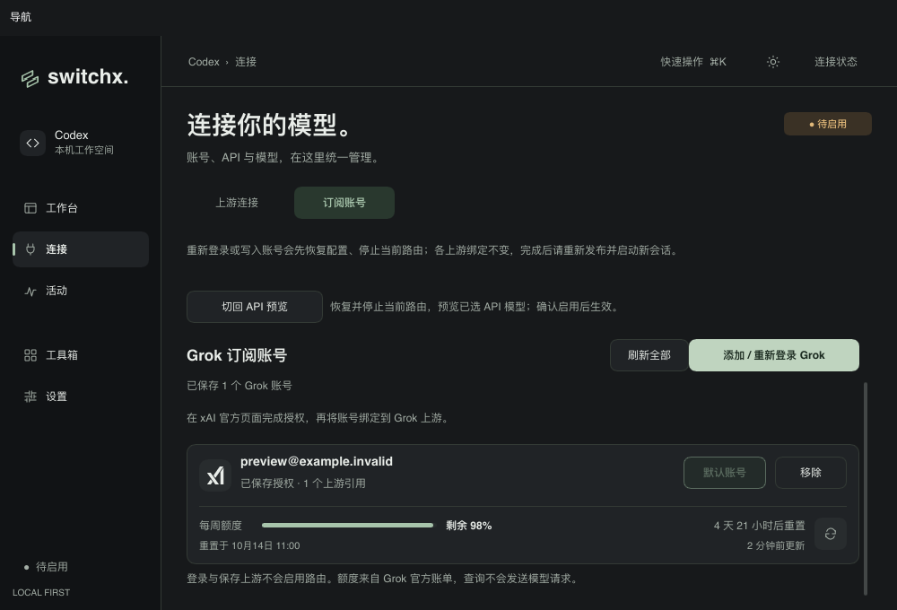
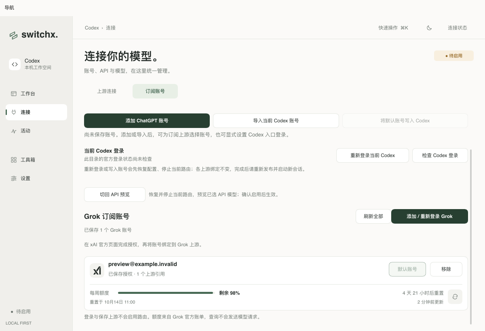
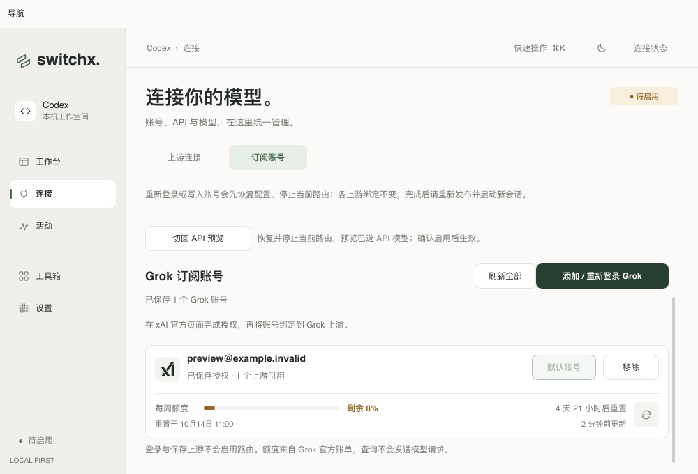
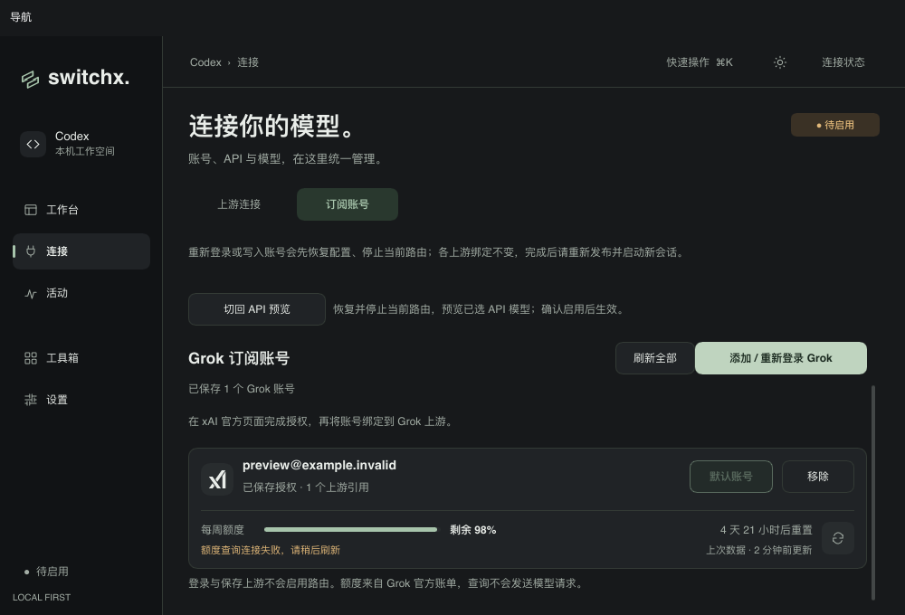

# Grok 账号额度与刷新时间（2026-10-09）

参考 `others/cc-switch/src-tauri/src/services/subscription_grok.rs` 的账单协议，在「连接 → 订阅账号」的 Grok 卡片中显示剩余百分比、进度条、重置倒计时、具体本地重置时间与最近更新时间。账号和管理操作位于上半行，额度与刷新按钮位于下半行；使用现有主题色，低于 10% 和用尽分别显示警示色。

进入账号页查询一次，新登录账号自动查询；支持逐账号刷新和刷新全部。查询使用独立后台任务，重复刷新正在查询的账号不会重复提交，也不会占用页面的全局 busy 状态。失败保留上次成功快照并显示错误；删除账号、重新登录和新一轮查询不会接收过时结果。额度快照只保存在内存里，时间文字每 30 秒更新，不自动轮询账单接口。

额度查询复用 Grok OAuth 账号的既有凭据刷新逻辑，固定访问 `https://grok.com/grok_api_v2.GrokBuildBilling/GetGrokCreditsConfig`，禁止重定向，限制响应大小。HTTP / gRPC 失败不会把上游响应正文或错误消息显示给用户。没有公开的 protobuf schema，解析规则与 CC Switch 对齐；窗口名称按重置间隔估算，未识别的数据明确报错，不当作 100% 剩余。

## 自动与视觉验证

- `make check`：Rust / Slint 格式、全目标 Clippy 和完整测试通过；197 项通过，1 项保留忽略。
- 新增模拟账单测试覆盖 framed / bare protobuf、零用量省略字段、百分比换算、零剩余、无效百分比、畸形帧、深层百分比候选、HTTP / gRPC 错误脱敏、响应大小和不跟随重定向。
- 界面状态测试覆盖逐账号刷新、并行账号状态、刷新失败保留旧值、账号列表重载、新旧查询结果隔离、删除后的晚到结果、时间更新和后台通道关闭；渲染检查确认时间变化与后台查询结果不会改变已滚动的卡片位置。
- `cargo run --locked --example provider_icons_preview -- /absolute/output --xai-quota`：使用生产 Slint 页面和合成账号，渲染深浅主题、1200×820 / 1000×680 两种尺寸，检查正常、低余额、用尽、首次加载、刷新中、查询失败、保留旧值及重新登录状态；像素断言检查短进度条从左侧开始，避免默认居中。
- `sh scripts/bundle-macos.sh`：本地 Debug 应用打包成功。

## 真实账单与原生应用

通过 `xai_quota_probe` 显式指定已有账号数据目录，默认 Grok 账号查询成功。原生应用进入订阅账号页自动显示与探针一致的剩余比例及重置时间；点击账号刷新按钮后仍正确显示额度与更新后的时间，其他管理按钮保持可用，界面状态仍为待启用。真实账号的账单数值未保存到仓库。

此验证只查询官方账单，不调用模型推理端点，不改动 Codex 配置或原生登录；它不证明模型权限、推理请求或完整订阅认证生命周期已验收。真实账号标识、凭据和数据库未进入仓库，以下图片全部使用合成资料。

