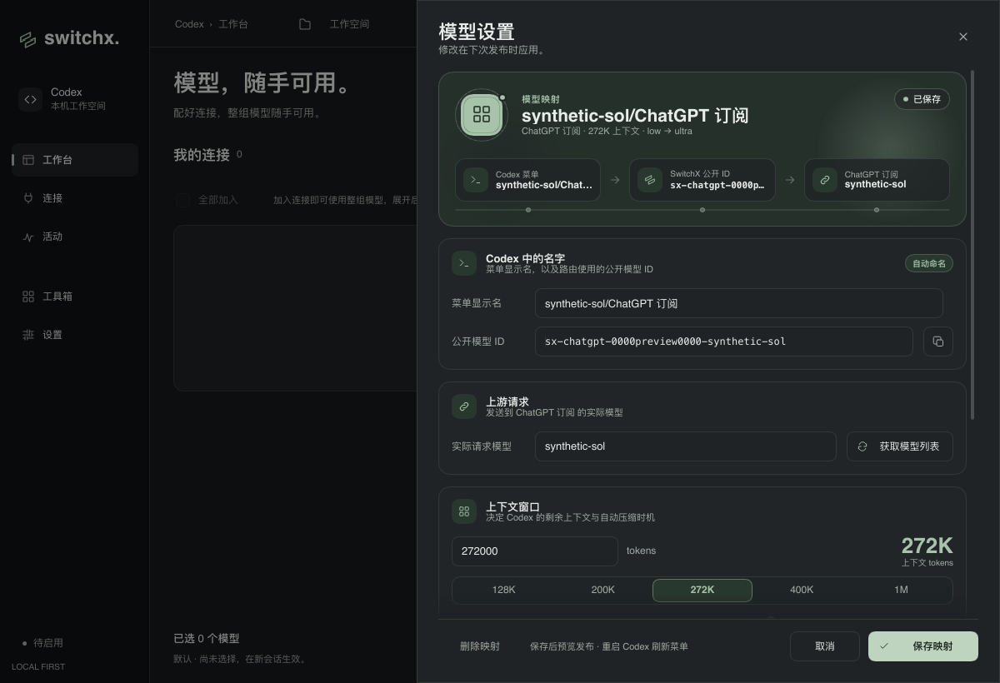
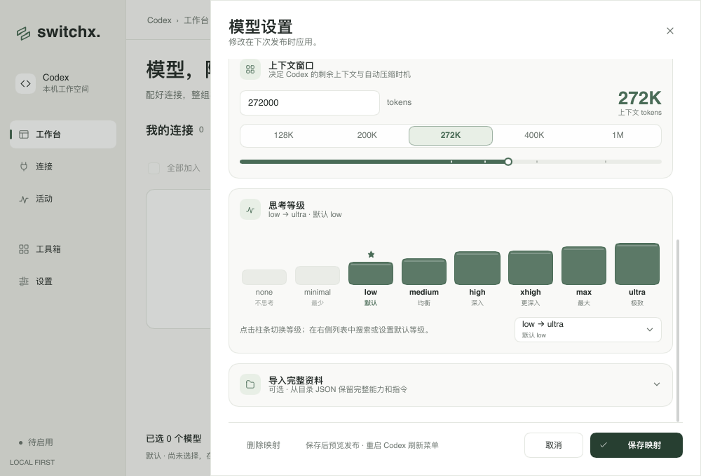
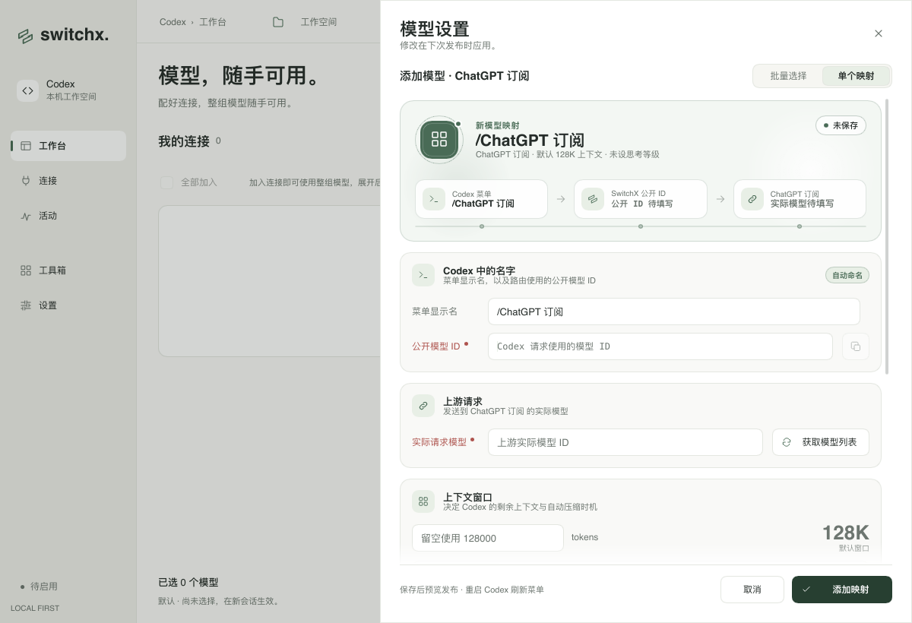
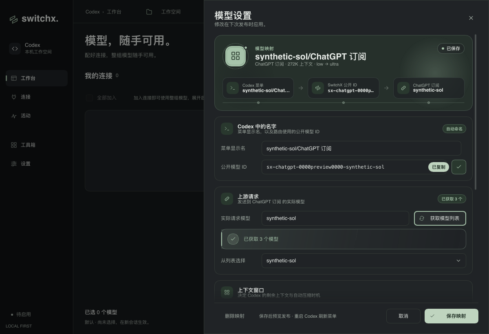
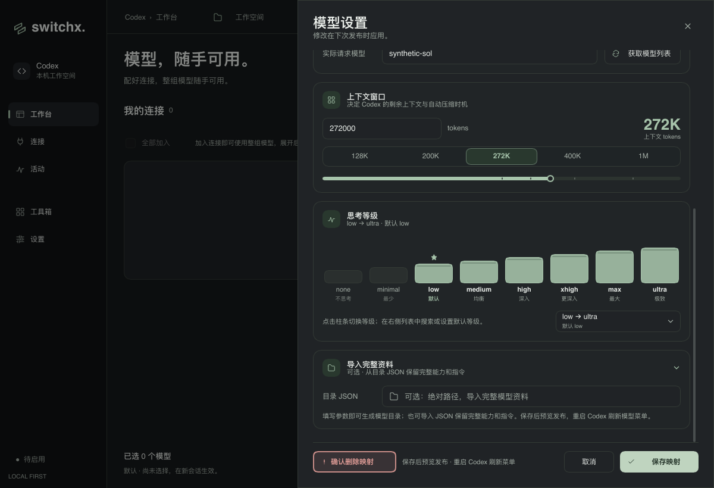
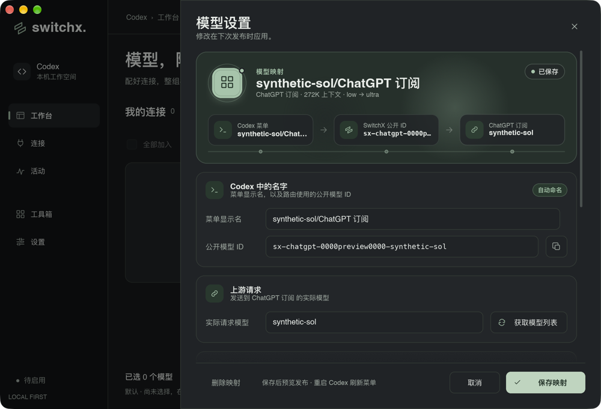
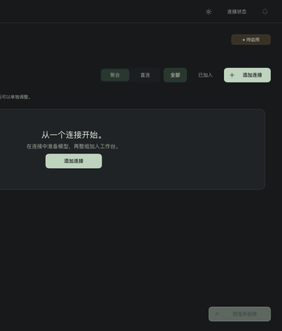
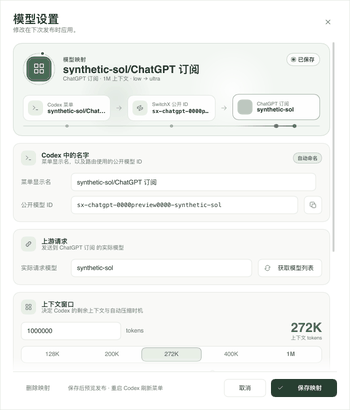

# 模型设置重设计

单个模型映射改成一条从上到下的“路由卡片”工作区。顶部 Hero 展示模型名称、所属连接、上下文和思考等级概要，并用三段路由图说明 Codex 菜单名 → SwitchX 公开 ID → 上游实际模型。下面依次是名称与标识、上游请求、上下文窗口、思考等级和可折叠的完整资料导入。保存、取消和删除固定在底部，不随表单滚动；内容滚动时底部渐隐提示还有更多。

- **名称与标识**：显示名自动生成时显示“自动命名”，手动修改后变为“自定义名称”，并滑出“恢复自动”。公开 ID 使用等宽字体，旁边的复制按钮通过输入框原生剪贴板复制，图标变成对勾并弹出“已复制”。
- **上游请求**：实际请求模型和“获取模型列表”保持原有回调，获取结果在卡片内反馈，并展开“从列表选择”。
- **上下文窗口**：输入框保留，新增 128K / 200K / 272K / 400K / 1M 预设、对数刻度条和大号读数。留空显示默认 128K；0 或非数字显示“需要正整数”。
- **思考等级**：八根逐级升高的柱条对应 none 到 ultra，点击即可增减等级，星标标出默认等级；取消默认等级会同时清除默认值。原有可搜索多选弹层保留在右下，用于搜索和设置默认等级。
- **完整资料**：目录 JSON 默认收起，填写后显示“已填写”标记；展开时视图会跟随滚动到新内容。
- 缺少显示名、公开 ID 或实际模型时，对应标签变红并带提示点。
- 添加模式保留“批量选择 / 单个映射”切换。批量选择去掉外层多余内边距后，列表在 1200×820 中更高，带获取结果横幅时也无需滚动整个抽屉。

## 动效

- 每次打开，或从批量选择切回单个映射，Hero 和五张卡片依次上浮淡入；Hero 有一次光泽扫过。
- 编辑器可见时，路由图上的光点沿轨道循环流动，经过的节点点亮并轻微上浮，箭头随之前推。模型图标外有卫星环绕，状态标签有呼吸波纹，背景光晕缓慢漂移。
- 获得焦点的卡片会抬起，左侧出现强调竖线，图标底色变成品牌色；字段标签同步变色。
- 上下文预设滑块带回弹，读数从旧值滚动计数到新值，刻度条带弹性填充。
- 思考等级柱条在入场时依次升起；选中时液面从底部上涨，悬停时柱条变高，默认星标弹出。
- 删除需要二次确认：第一次点击后按钮变宽变红，并抖动一次；5 秒内不确认会自动恢复，Esc 也可取消。
- 动效使用 `Theme` 时长。关闭动画或启用系统“减少动态效果”时，界面直接显示最终状态，所有循环动画停止。

## 行为边界

保存、删除、获取模型、显示名推导和思考等级的数据格式继续沿用原有回调和 Rust 校验。新增的 `restore-display-name` 只调用已有的 `update-model-display-name`。保存仍在忙碌或配置受管时禁用；配置受管时底部提示改为警示色。界面不新增凭据展示，复制只作用于公开模型 ID。

## 验证

```sh
make check
cargo run --locked --example provider_icons_preview -- /absolute/output --model-editor-design
cargo run --locked --example provider_icons_preview -- /absolute/output --batch-models
cargo run --locked --example provider_icons_preview -- /absolute/output --model-editor-native
```

`make check` 通过：Rust / Slint 格式、全目标 Clippy，229 项测试通过，1 项原有测试忽略。

`--model-editor-design` 使用合成数据，在 1200×820 和 1000×680 两种窗口、深浅两种主题中检查以下交互：输入显示名会切换为自定义，恢复自动后会重新推导；复制会写入公开 ID；可以获取模型列表并选择结果；1M 预设会写入 `1000000`；可以展示无效值和默认值；柱条可以增减等级，并在取消默认等级时清除默认值；完整资料可以展开；删除需要二次确认；保存在两种窗口中都可点击，配置受管时禁止保存；取消会关闭编辑器；添加模式和批量模式都能正常切换。动画帧覆盖入场、路由循环、上下文计数、复制、删除抖动、柱条填充、展开跟随滚动，以及重新打开时重播入场动画。

截图和 GIF 来自 Slint 软件渲染。该渲染器不支持渐变圆角和图片旋转，所以设计中避免使用带圆角的渐变，折叠箭头的旋转只在原生窗口中可见。`native-dark.png` 来自 `--model-editor-native` 打开的 macOS 原生窗口（femtovg 渲染器）。所有数据均为合成数据，不读取真实账号、不写入 Codex 配置，也不访问真实上游。

## 截图
















