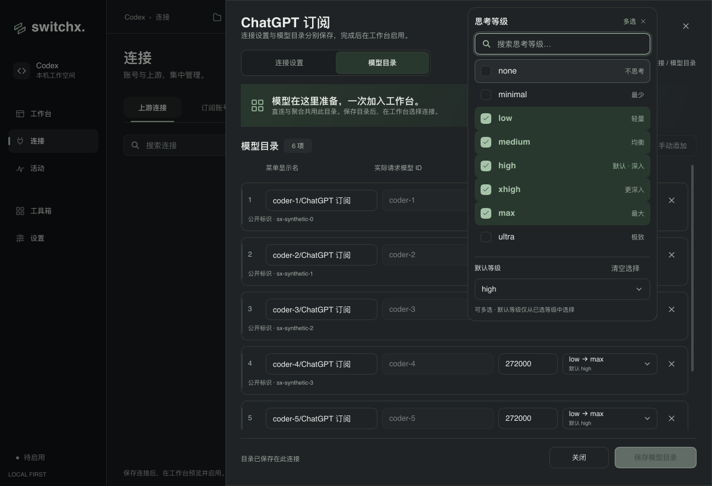
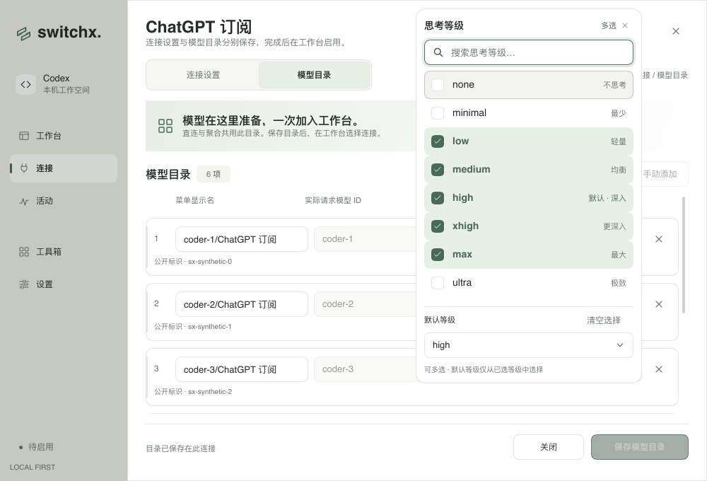

# 思考等级多选器验收

连接模型目录与单个模型编辑器共用可搜索的多选弹层。支持 `none`、`minimal`、`low`、`medium`、`high`、`xhigh`、`max`、`ultra`；按钮压缩显示连续等级范围，并单独显示默认等级。

默认等级仅列出已选项。取消默认项或清空选择会清除默认值；默认值随目录原子保存，重新打开时读取已保存值。发现结果进入目录草稿时保留模板默认值。已有模型的公开 ID、工作台选择和完整能力资料沿用原来的保存流程。

弹层采用 240ms 淡入与位移、150ms 退出，箭头旋转、悬停和勾选同步过渡。关闭动画或系统减少动态效果时即时完成。弹层限制在窗口内，短窗口可滚动；搜索忽略大小写，也支持中文说明。上下方向键移动，Enter 切换选择，Esc 关闭，关闭途中 Enter 可重新展开。多选后继续保留搜索焦点。

验证均使用合成模型和临时数据库，没有读取真实账号、修改 Codex 配置或调用真实上游。

- `make check`：Rust / Slint 格式、Clippy 和全量测试通过（229 passed，1 个既有 ignored）。
- `cargo test --locked --test reasoning_picker --test connection_directory`：深浅主题、1200×820 / 1000×680、搜索、无结果、多选、清空、默认值、键盘、外部关闭、禁用状态、动画进出与打断、减少动态效果，以及默认值保存 / 重读和无效组合原子拒绝。
- `cargo run --locked --example provider_icons_preview -- /absolute/output/directory --reasoning-picker`：真实 Slint 组件的软件渲染截图和 16ms 动画帧。

[展开 / 收起动画](screenshots/reasoning-picker/motion.gif)

