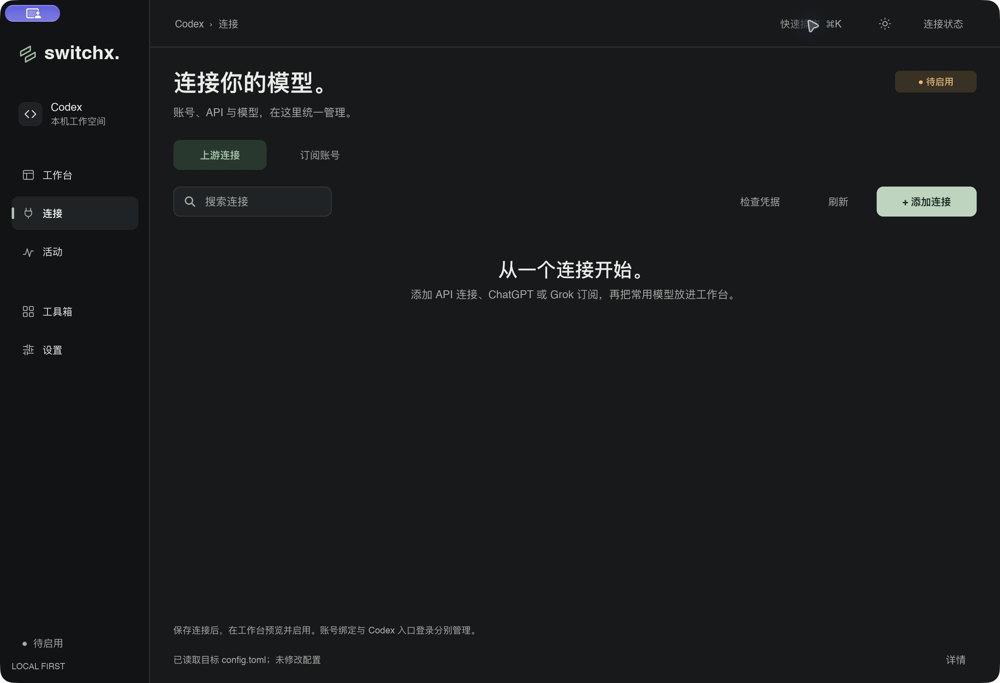
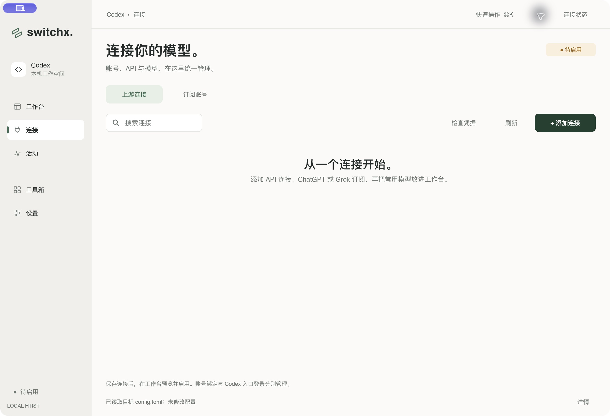

# macOS 标题栏融入界面 · 2026-10-08

隐藏窗口标题栏的独立背景和标题文字，让侧边栏与工具栏延伸到窗口顶部。保留原生红黄绿按钮、窗口圆角、关闭隐藏行为和系统缩放。窗口内部仍保留 `switchx` 标题，供无障碍和系统窗口管理使用。

macOS 在创建 Slint 组件前选择 Winit 后端，启用透明标题栏、隐藏标题和全尺寸内容视图。共享窗口为原生按钮预留 44px，进入全屏后恢复 26px 的侧栏顶部间距；顶部空白使用 `WindowMoveArea`，不覆盖工具栏按钮。其他平台保持系统标题栏和原有间距。

## 验证

```sh
make check-app
cargo run --locked --example window_chrome_probe
make check
sh scripts/bundle-macos.sh
```

桌面入口、原生探针和完整检查通过。完整检查包含 Rust/Slint 格式、Clippy，以及 189 项通过的测试；另有 1 项需要本地 Codex CLI 的目录解析测试按原配置跳过。

`window_chrome_probe` 创建纯 UI 窗口，不读取供应商数据、凭据或 Codex 配置。通过 AppKit/Winit 直接断言首次显示、退出全屏、关闭后重新显示、1000×680 最小尺寸下的透明标题栏、隐藏标题、全尺寸内容视图、原生装饰与三枚未隐藏的系统按钮；另断言全屏确实进入和退出、窗口仍可缩放。

另以独立 bundle、绝对 `SWITCHX_DATA_DIR`、隔离 `CODEX_HOME` 和禁用的 Codex CLI 检查真实桌面入口。实际点击检查连接页、快速操作和深浅主题；执行顶部空白拖动与原生缩放/还原。缩放截图从 2400×1640 变为 3476×2260，还原后回到 2400×1640。点击红色关闭按钮后窗口隐藏，进程仍驻留。重新显示的窗口参数由原生探针验证，未执行托盘菜单点击重开的人工验收。

复跑完整检查时，既有 `canceled_workspace_discovery_cleans_private_context_before_idle` 测试曾在等待合成 CLI 启动标记时超过两秒。结束桌面验证后，当前版本与改动前测试二进制的单项检查均通过，最终完整检查也通过。没有修改账号代码或测试超时。

隔离配置文件保持原样，未创建 `auth.json`；未执行真实账号登录、保存凭据、路由发布或上游请求。

## 截图

截图为 1200×820 逻辑尺寸、Retina 2× 的原生窗口。左上角紫色标识是系统的远程控制提示；原生探针确认红黄绿按钮存在且未隐藏。




